# 如何免费打造打造一个安全稳定低延迟超高速的科学上网环境

这篇文章将会介绍如何获取由 Google 提供的一年 $300 美金的试用金，然后使用 HyperApp 搭建一个低延迟超高速的科学上网环境。网络延迟基本在50ms左右，并且可以流畅观看 Youtube 4K 视频。本文不需要读者有较深的技术背景，全部过程都可视化、自动化完成。

下文用 GCP 代表 Google Cloud Platform，指 Google 的整个云平台。GCE 是指 Google Cloud Engine，是 GCP 产品线里的一个主机产品。

#### 本文前提条件

1. 有一个 Google 账号，没有的话可以注册一个。
2. 注册 GCP 免费试用需要用信用卡进行身份验证（只做验证，不会收费），所以你必须有一个 Visa/MasterCard 的信用卡才行。

#### 本文目录

1. GCP 注册以及创建服务器
    * 注册 GCP
    * 新建主机
2. HyperApp
    * 添加服务器到 HyperApp
    * 配置公钥
    * 开启 BBR 加速，跑满带宽
    * 部署科学上网应用
3. 客户端设置
4. 常见问题

---

## GCP 注册以及创建服务器

要访问 Google 首先需要你能科学上网，但是这篇文章又是介绍如何科学上网的，好像有点🐔生蛋蛋生🐔的矛盾… 其实你可以去App Store搜索 V屁恩，找一个免费的下载后，通过签到等方式暂时领取一天或者几个小时的免费低速试用来完成下面的教程。

### 注册 GCP 免费试用

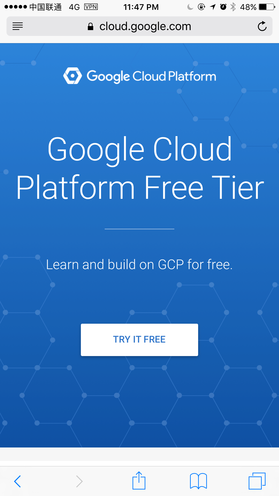 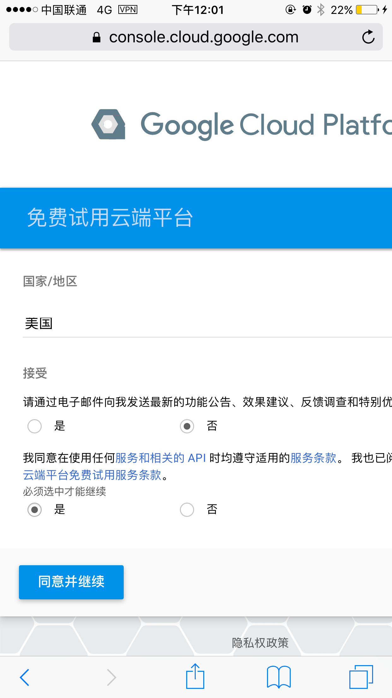
   

1. 登录Google账号后使用这个链接来注册 https://cloud.google.com/free/ ，在打开的页面中点击“Try it Free"。
2. 接受条款，并点击”同意并继续“
3. 在页面中填入你的信息：
    * 账号类型：个人
    * 名称和地址：填写你的地址、电话等
    * 付款方式：添加一个信用卡。这个信用卡将会用来验证身份，防止GCP被滥用。
    * 点击 ”开始免费使用“ 完成注册

在后面的页面中，如果你能看到页面顶部有一个“礼物 🎁 ” 的小图标，说明已经获取了试用金。

### 新建主机

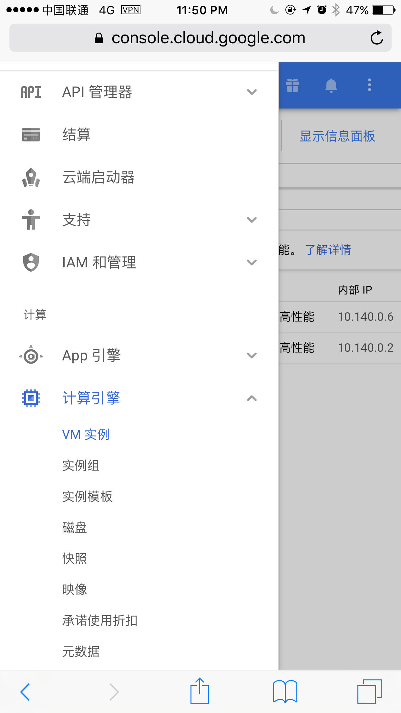 

1. 按照上图所示，在左侧菜单中导航到 [计算引擎 → VM 实例](https://console.cloud.google.com/compute/instances)
2. 点击加号按钮，创建一个 VM 实例。

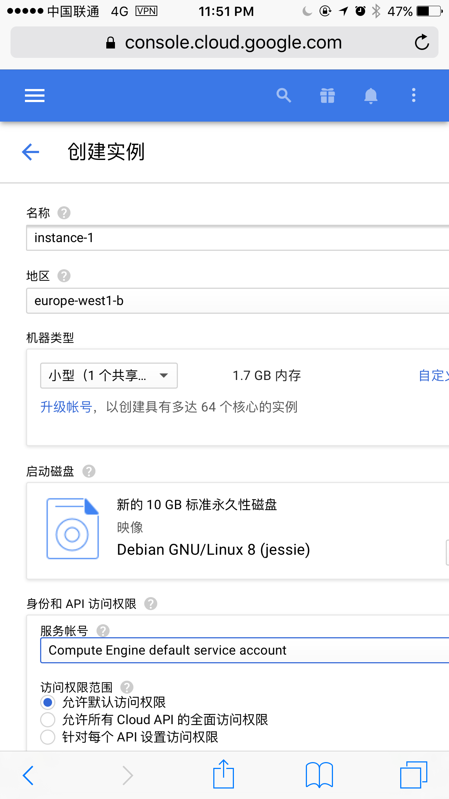 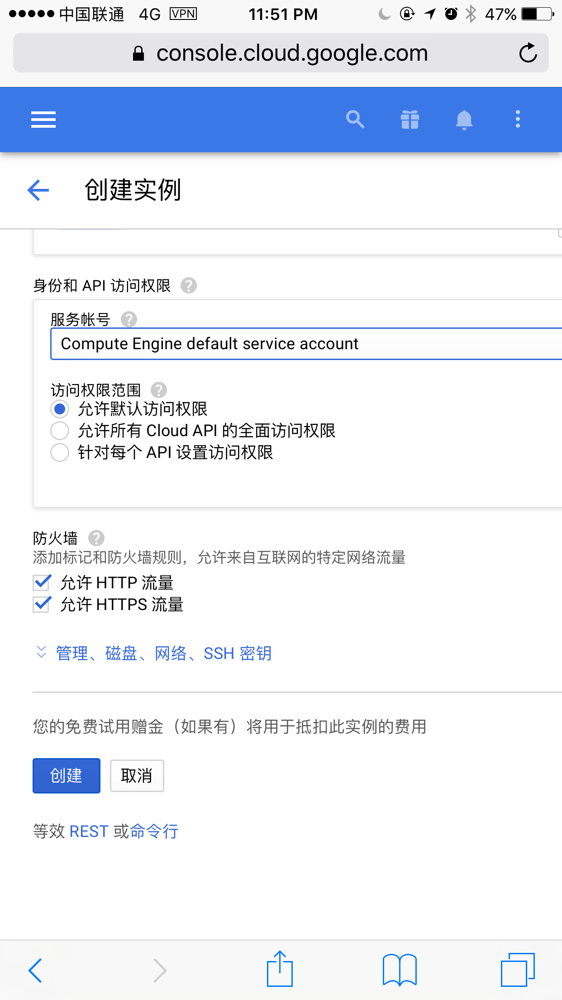

* 名称：随意填入一个易记得名字
* 地区：建议选择 `asia-east1-*` 三个中的任意一个，这个机房是在台湾，国内的延迟只有 50~70ms，简直快到飞起。
* 机器类型：选择 “小型” (1.7G 内存) 就可以了。默认选中的 3.75G 的内存其实用不完。（只用SS的话建议选最低配置的，这样每月大约可以留出来80G流量）
* 启动磁盘：默认的Debian 8就可以，推荐 Ubuntu 16.04 或者 CentOs 7，但是为了防止将来磁盘不够用，你可以点击右下角的更改，大小里使用 20G 或者 30G。
* 防火墙：选中 “允许HTTP流量” 和 “允许HTTPS流量”

**注意：GCE 的 CentOS 有各种小问题，如果你执意要用 CentOS 遇到问题请自行 Google**

点击”创建“，稍等几分钟就会创建完毕，现在打开 HyperApp 开始配置这台服务器吧。

---

## HyperApp

HyperApp 是一个部署自动化以及服务器监控管理的App，致力于让普通用户也可以使用云服务。HyperApp 可以监控服务器/路由器的运行状态，还可以可视化的一键部署各种应用。
本段介绍如何使用 HyperApp 管理刚刚创建的服务器，开启 BBR 加速，安装科学上网应用。

### 添加服务器到 HyperApp

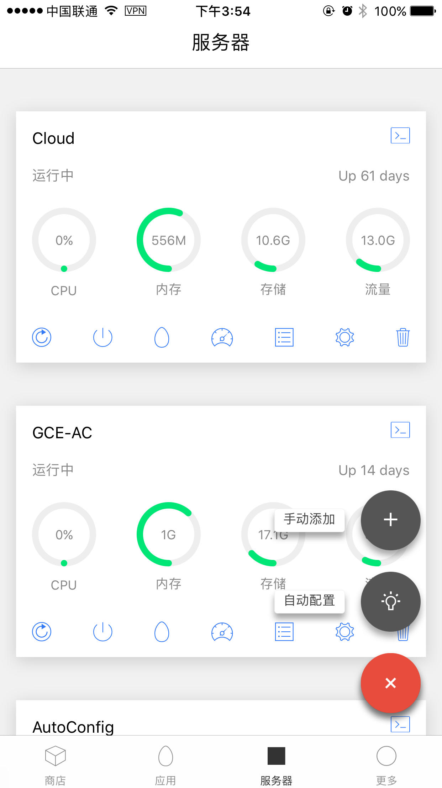 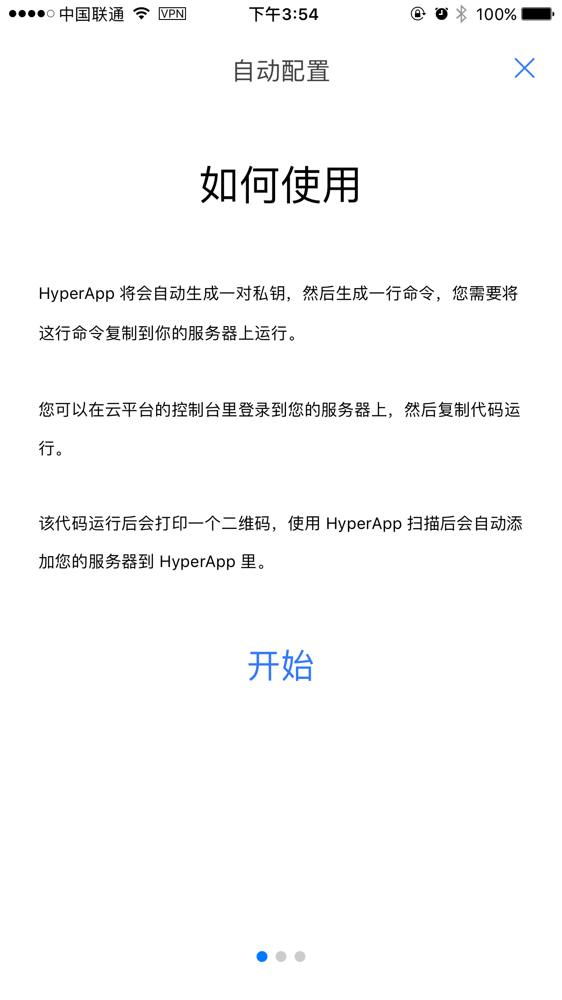

1. 在 “服务器” 页面点击右下角的加号，然后选择第二个”自动配置“
2. 点击“开始”，应用会自动生成一对密钥，请耐心等到几秒~十几秒。
3. 等到出现“一切就绪”时，点击“复制“将代码复制到剪贴板里，如果你用电脑操作的话可以点击”发送“将代码通过任意一种方式发送到电脑上。

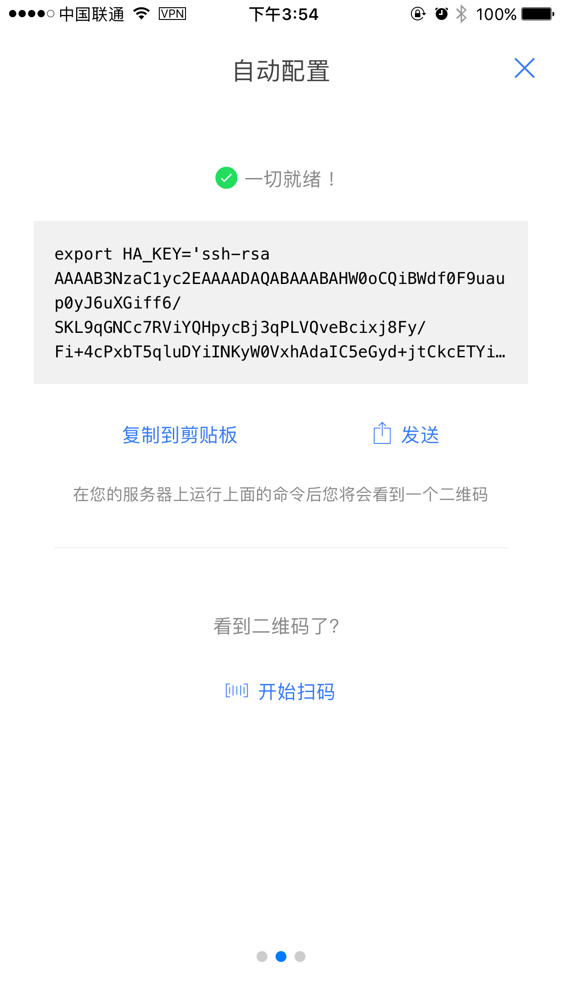 

在 GCE [计算引擎 → VM 实例](https://console.cloud.google.com/compute/instances) 页面，选择刚刚创建的实例的 `SSH ▽ 在浏览器窗口中打开` 打开一个基于 Web 的 SSH 终端。

在浏览器的SSH中粘贴并运行刚刚复制的代码。等到二维码出现时，使用 HyperApp 扫描该二维码便会自动添加该服务器。添加后 HyperApp 会检测刚刚添加的服务器的基本运行状况。

### 永久添加公钥

注意：你可以暂时跳过本小段，进行后续的操作，如果 HyperApp 出现了**密钥认证错误**的提示，可以回到这段进行操作。

刚刚的自动配置的功能在几乎所有主机上都可以用，但是 GCE 是个例外，它会清空用户自行添加的公钥，所以几分钟后可能就会出现密钥认证失败的错误。你可以通过以下步骤永久性的设置密钥。

1. 打开 `HyperApp` → `更多` → `SSH Keys` → `点击唯一的一个 Key` → `复制公钥`。
2. 打开 [GCP → 计算引擎 → 元数据 → SSH 密钥](https://console.cloud.google.com/compute/metadata/sshKeys) 点击修改后，复制并添加刚刚的公钥。
3. 添加后页面会出现一行新记录，主要有两列：用户名 和 密钥。然后确保 HyperApp → 服务器 → 点击服务器下面的齿轮按钮 用户名为这儿显示的用户名，保存后就可以了。（如果你按照上面的步骤操作，HyperApp 自动修改用户名所以这两个用户名应该默认是一致的）
4. 添加以后同一账号下所有新建的主机都可以不用再次操作了。

---

### 开启 BBR 加速，跑满带宽

这一步并不影响科学上网，但是会极大的提高上网质量。BBR是 Google 开发的TCP拥塞控制技术，并且已经合并到较新的Linux内核中。它的主要作用是可以让你跑满服务器的带宽。

比如说没有开启的情况下你观看 Youtube 720P的视频都可能会卡，但是开启了BBR后 1080P 的视频完全无卡顿，就连 4K 视频也可以流畅观看（有些网络特别卡的除外）。

要开启 BBR 需要升级 Linux 内核，不过不用急，在 HyperApp 中开启非常简单：

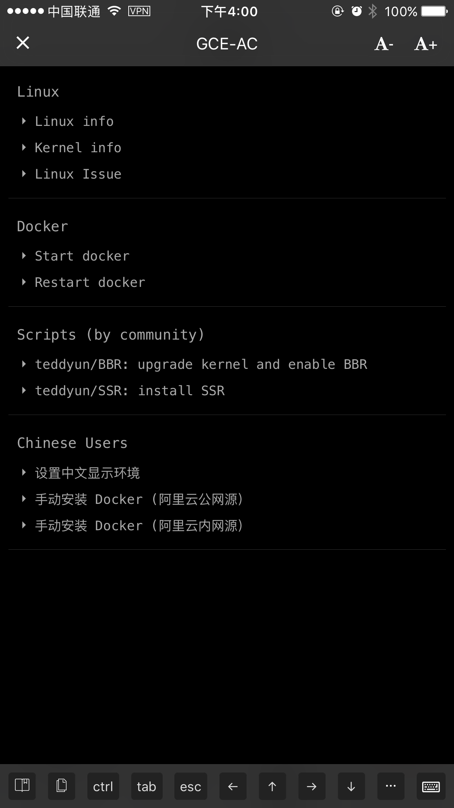

1. 在服务器卡片中点击右上角的 Terminal 图标，进入 SSH 终端。
2. 选择最下面的一行工具栏的第一个图标，然后点击 "teddyun/BBR" 一键脚本的链接，点击后会让你确认是否下载并执行外部脚本。
3. 点击确认后会自动下载并执行，执行过程中需要点击键盘上回车键确认继续。如果想中断执行，那么点击 `ctrl` 后按 `c` 终止执行。
4. 稍等几分钟，等待系统内核升级到最新版后会自动重启（重启时终端会显示Done 和 Shell Closed）然后关闭窗口即可。
5. 如果你想确认 BBR 有没有安装成功，那么再次进入 SSH 终端，输入 lsmod | grep bbr 如果能看到一行记录就是成功了。

注意：一定要先升级BBR再安装应用，反过来会出错，如果你不小心操作错了顺序，请看文末的附录。

---

### 部署科学上网应用

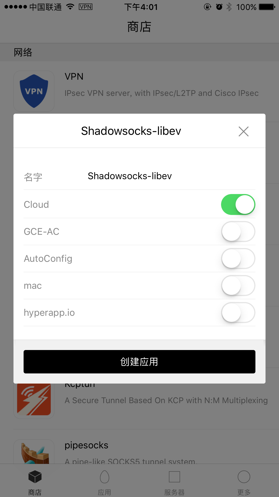 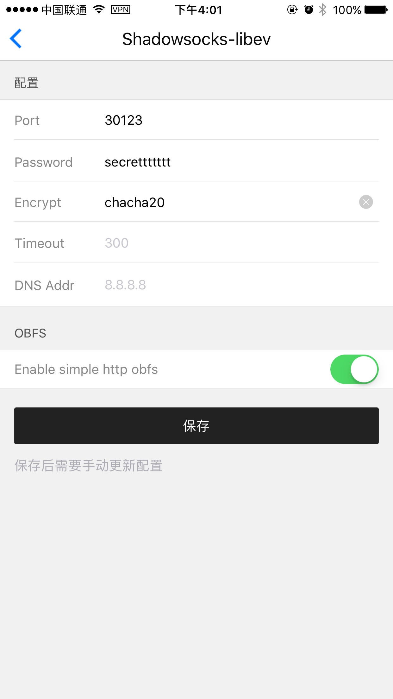

在 `HyperApp` → `商店` 页面 `网络` 分组下选择任意一个应用，这里我们选择占用资源最少的 `****-libev`，（下文用SS代替）点击该应用。在弹出的对话框中选择刚刚添加的服务器，点击`创建应用`

在此页面中输入简单的一些配置：
* Port: 端口，可以填入 80 或者 443（因为用其它端口需要设置防火墙）
* Password：随便填入一个密码
* Encrypt：选择一种加密方式，推荐针对移动访问优化的 `chacha20`
* OBFS: 使用 OBFS 可以将 SS 流量伪装成正常的网页访问从而达到欺骗效果，可以防止被墙或者运营商干扰。

如果你使用其它端口，请参考文末的 [设置GCE防火墙](#设置-gce-防火墙) 如何开启防火墙。

如果安装的过程中出现错误，可以截图后进群寻求帮助，但最快的方式依然是：建一个新的vm重来一遍！真的，很神奇的！

---

## 客户端设置

### iOS

iOS 上有很多 SS 的客户端可供选择，收费的有 小火箭、土豆丝、Surge等。免费的可以使用 Wingy。

配置很简单，只需要点击应用卡片里的服务器栏，然后选择顶部的QR，截图后用其它客户端扫码即可。

如果你想手动配置，请按指示填写参数即可，下面和配置和上面 【部署科学上网应用】段落里第2步的配置一一对应：

* 服务器：填入你的服务器外部 IP（GCP后台 VM列表页面有一列外部IP，就是那个）。
* 端口：上面配置界面里面的端口（80，或者443）
* 密码：上面配置界面里面的密码
* 加密方式：上面配置界面里面的加密方式

### Mac/Windows

Mac 和 Windows 上都有免费的 SS 客户端可以使用，配置方法也是只要输入你的IP、端口、密码和加密方式即可。

---

## 常见问题：

### 如何建多个账号？
你可以创建多个应用给不同的人使用，一个应用只占 1~2M 内存（但注意每个应用的端口必须不同）

### 信用卡被扣一美元？
这是验证信用卡信息是否正确的，快则几分钟慢则几小时就会退款。

### 结算账号被关闭怎么办？
你可能没仔细填信用卡信息，查看你的邮箱应该会有一封谷歌的通知邮件，按照提示传下资料，几个小时左右就会被解封了。

---

### 其它玩法

现在你有了一台 1.75G 内存的服务器了，只用来做SS好像有点浪费（SS只占用几M内存），其实使用 HyperApp 还有很多其它玩法，商店里面有很多其它应用，都可以自动安装配置。

比如你可以自己搭建一个博客、网站、论坛，个人网盘，聊天服务，并且可以自动配置HTTPS。如果你玩游戏可以创建一个 Minecraft 服务器。或者部署一个接收微信消息转发到Telegram的机器人。更多信息可以参阅👇 的 HyperApp 文档和教程。

### HyperApp 支持

[官方文档和教程](https://github.com/waylybaye/HyperApp-Guide)  
[Telegram 群](https://t.me/hyperapp)
[Twitter @HyperApp](https://twitter.com/HyperAppCloud)

如果你遇到了各种各样的技术问题，比如无法安装、无法连接等，可以在群里召唤机器人或者开发者进行解答。或者在App里面点击 发送反馈邮件 获取帮助，这两种是最快的获取帮助的方式。

### 设置 GCE 防火墙

1. 在GCP后台点击 [网络 → 防火墙规则](https://console.cloud.google.com/networking/firewalls/list) 
2. 点击 `创建防火墙规则`
    * 名称：随便输入一个名称
    * 目标：选择 `网络中的所有示例`
    * 来源过滤：`0.0.0.0/0`
    * 协议和端口：`指定的协议和端口` 下面输入 `tcp;udp:端口号`

### 自建和购买商业服务对比有什么优势？

1. 最主要的优势是隐私和安全，如果你看下上面SS的日志，你就知道服务商可以知道你的所有浏览历史的，如果你访问了不支持HTTPS的网站，那么请求内容也可能被监控（比如密码信息）。
2. 另外是质量和成本，很多商家是使用和上面同样的机器但是卖给几百个人，你应该能明白了。成本方面没有免费试用的话1个人用可能会有点贵，但如果和朋友家人一起用就超值了，比如使用$2.5/月的 Vultr，每月500G 流量够很多人用的。
