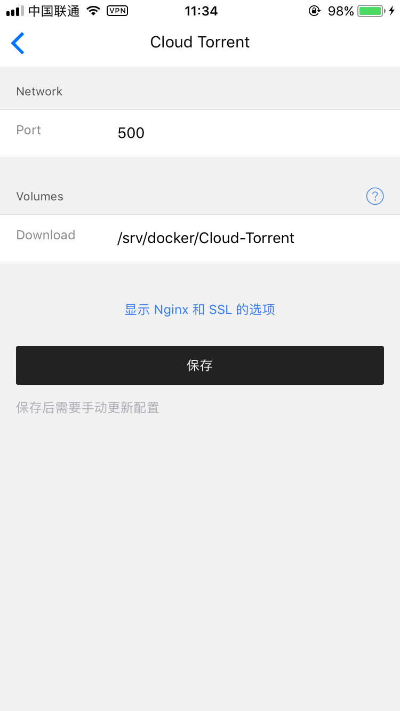
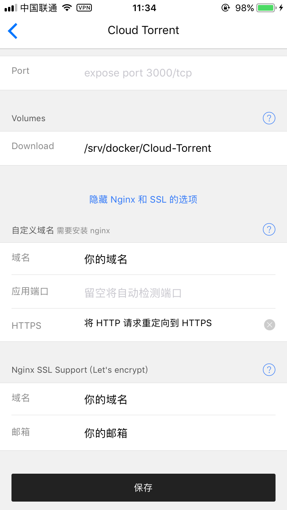
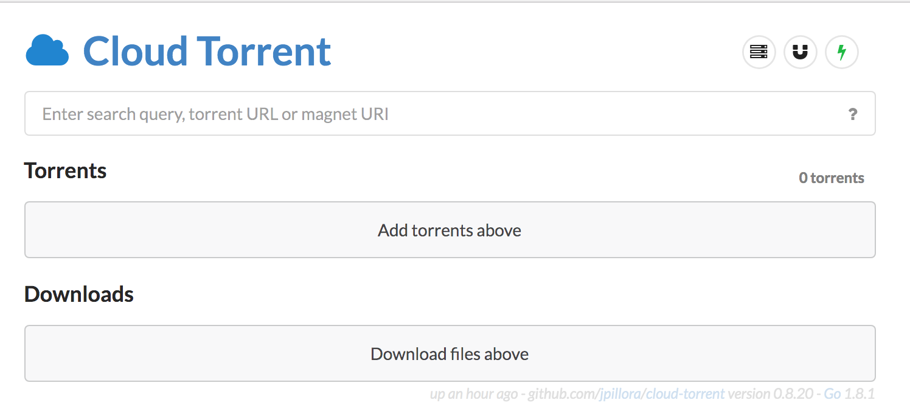
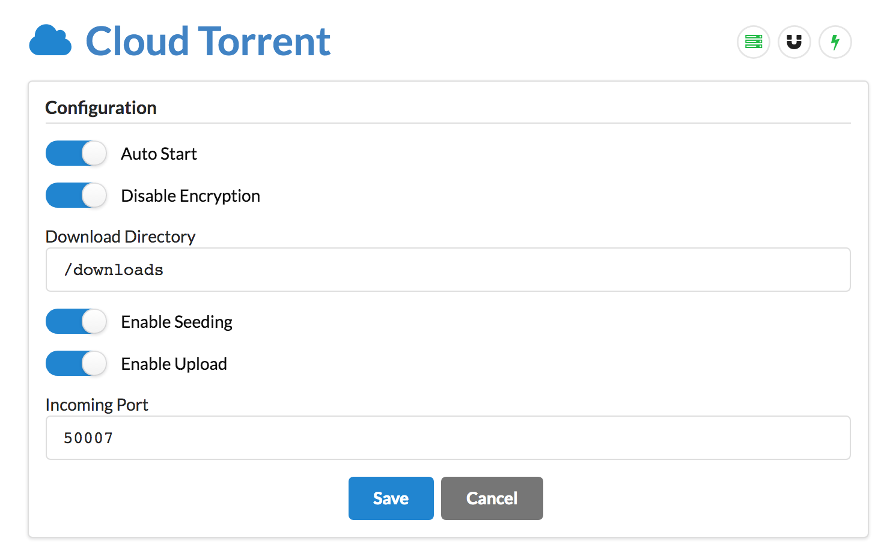

# VPS 上搭建高速 BT 下载服务

> **很多人觉得自己的 VPS 空着也是空着不如拿来发挥点余热.于是今天就给带来一篇在 VPS 上跑起来轻量化BT离线工具 Cloudtorrent 的教程.**

* **本文原文链接https://vinga.tech/bt**

## 准备工作

* **运行了 Hyperapp 的 iOS 设备**
* **一台 VPS**

## Hyperapp 配置

* **如果追求简单.直接通过 ip + 端口 的形式就能访问的话参考如下配置**
* **如果追求可以通过域名来访问的话.参考如下配置**
* **注意方式一中端口可以自定义.**

## 服务器配置

1. **我们现在登录 ip:端口 或者你给 cloudtorrent 绑定的域名.就可以来到这样一个界面.**

2. **先不要着急添加磁链或者BT开始下载.设置之前是没有速度的.先设置这个.**
3. **save 了之后基本上就可以了.看不懂的选项就不去动他.**
4. **对于需要更高速度更高稳定性表现的, 请自行添加 tracker list , 这里给一个连接**

   * `https://github.com/ngosang/trackerslist/`

## 写在最后

* **写了这么久.如果能有所收获那就是我最大的荣幸了:)**
* **如果可以的话.可以关注一下 https://vinga.tech 这是我的私人博客地址:)**
* **如有问题可发邮件至我邮箱联系或 telegram@fanvinga**

