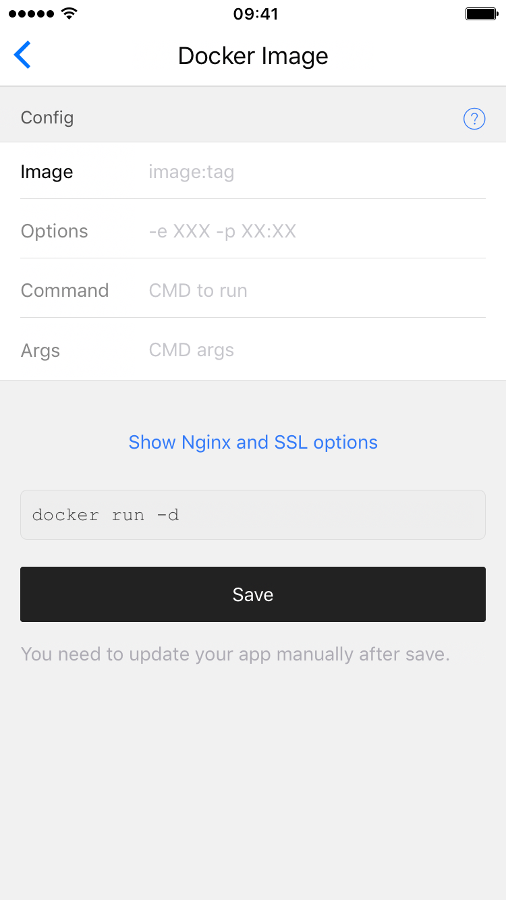

# Docker-image 介绍

>在使用过HyperApp一段时间后，相信它的便利性与易上手的特性得到了你的认同。经过一段时间的使用，您可能也会发现，你需要的一些功能HyperApp并没有提供或者说你想要更大的自由度。那么今天介绍的 HyperApp中的Docker-image应用或许可以帮到你。

## HyperApp 的原理

HyperApp 的所有应用都是基于Docker技术的，Docker技术是一种新兴的虚拟化技术，轻量，高效，不用担心依赖问题是它的强项。传统的 Docker 服务一般是在命令行下通过执行一大串指令来达到想要的效果。而命令行下的黑窗和指令的繁杂就足以另一些不懂 Linux 的人望而却步。而 HyperApp 的一大优点就是将一串串指令图形化，对新手非常友好。

HyperApp 中内置了许多经过作者精心调整的镜像，对于新手而言部署起来非常方便。但凡事都有两面性，便利性得到满足时，可定制行就容易被压制。如果你需要运行自定义的镜像或者非HyperApp提供的镜像，那么HyperApp 中的`DockerImage`这个应用可以满足你

以下就是Dockerimage的界面


其中主要的配置如下:

```
Image          镜像，和命令行中的Docker一样，格式为"镜像名:标签"
Options        选项, 和命令行中类似，格式为'-x xxx'等，这取决与镜像的设定与你具体想要什么功能
Command        命令，一般取决于Docker中的内置设置
Args           参数，一般取决于Docker中的内置设置
```

以上主要配置已经介绍完成，此外在底部还有于Nginx驳接的选项，用于在需要Nginx的时候可以填写，之前已有介绍，这里不再赘述。

这种配置方式的优势就是可以自己写v2ray的配置文件，只要以config.json的文件名丢进/etc/v2ray/文件夹中，镜像便会读取。配置上拥有更大的自由度。

- 填完参数后在最底部可以看到由`docker run -d`开头的指令，这一串指令就是真正要在机器执行的指令，可以看出HyperApp将繁杂的参数简单化了。之后将慢慢介绍具体的使用方法。
