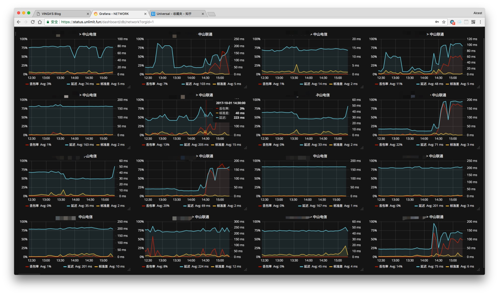
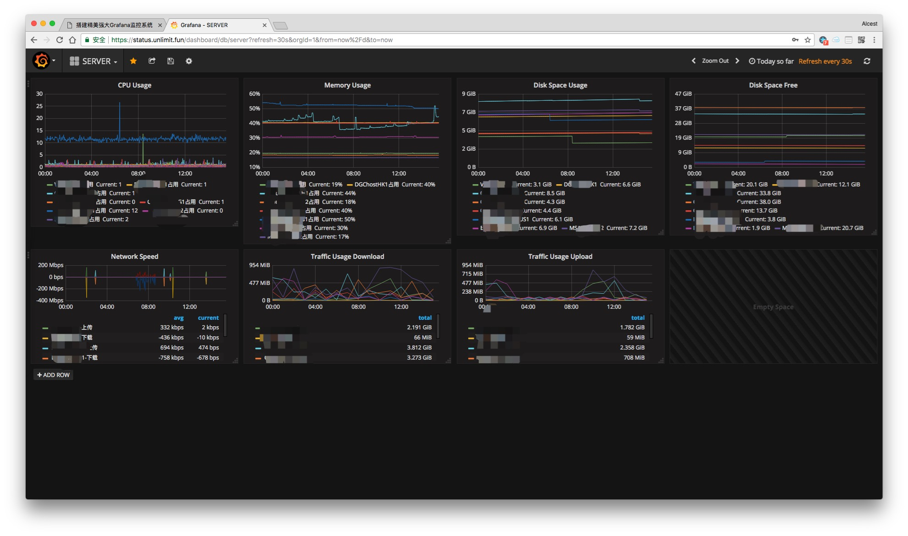
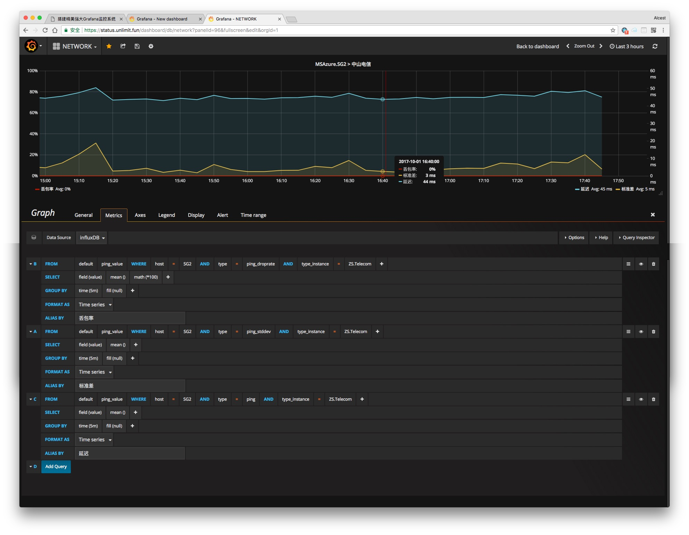

## 搭建精美强大Grafana监控系统


> **随着剁手越来越畅快.手里积攒的小鸡也越来越多了.那今天就讲解一下怎么样搭建一个美轮美奂的基于Grafana+influxDb+Colletcd的监控系统.感谢开源世界!**


## 更新记录

- 2018.08.10:根据collectd-core的最新安装情况修改了一下配置文件的描述
- 2018.08.06:更改了初始命令.使用了更加官方的配置文件生成方式.
- 2018.04.05:改动了一下文档.改进了collect的的安装命令以及配置文件.安装更少的核心以及必备依赖即可.注意collectd的gpg提供有问题.暂时没有找到正确的.所以更新的时候要加上`--force-yes`进行更新.
- 2017.12.20:修改了获取`InfluxDB`容器名称的命令.更直观简单
- 2017.12.3:修改了`InfluxDB`的启动参数.让暴露端口更少.更安全
- 2017.10.1:增加了网络拓扑部分.


## 效果截图





## 网络拓扑


## 准备

* VPS需要先安装好`docker-ce`
* HyperApp
* 一个已经解析正确的域名（ping验证）
* 耐心.仔细.认真


## 监控端部署

#### 首先执行命令


```
mkdir -p /root/monitor/{collectd,grafana,influxdb,influxdb/{conf,db,monitor}}
curl -ksSL raw.githubusercontent.com/collectd/collectd/master/src/types.db > /root/monitor/collectd/types.db
docker run --rm -it influxdb:alpine influxd config > /root/monitor/influxdb/conf/influxdb.conf
```
* 然后使用你喜欢的文本编辑器`vim/nano`对`/root/monitor/influxdb/conf/influxdb.conf`进行编辑.找到`[[collectd]]`配置项.并把`enabled = false`更改为`enabled = true`.保存即可
* 执行完这些命令会在`/root`目录下生成我们所需要的一些文件和目录.


#### 其次部署安装InfluxDB

1. 转到商店页面.找到`Docker Image`然后选择服务器并且保存进入配置界面
2. 请完全按照下图配置进行填写！
3. 保存并且进行安装.

|    应用设置名称     |                    内容                    |
| :-----------: | :--------------------------------------: |
|     Image     |             influxdb:alpine              |
|    Options    | -p 25826:25826/udp -v /root/monitor/influxdb/conf/influxdb.conf:/etc/influxdb/influxdb.conf:ro -v /root/monitor/influxdb/db:/var/lib/influxdb -v /root/monitor/collectd/types.db:/usr/share/collectd/types.db |
|    Command    |   -config /etc/influxdb/influxdb.conf    |
|     Args      |                                          |
| Nginx设置名称 |     InfluxDB不需要nginx分流.请留空并隐藏设置      |


#### 部署collectd并且把数据传给InfluxDB

*  这里我只讲`Debian 8`的安装办法.除此之外请自行Google搜索`collectd`安装办法
*  执行以下命令更新源并安装`collectd`

```
echo -e "deb http://pkg.ci.collectd.org/deb jessie collectd-5.7 \n" >> /etc/apt/sources.list.d/collectd.list
apt-get update && apt-get install collectd-core liboping-dev -y --force-yes
```

*  自行修改下列内容然后创建并添加内容到`/etc/collectd/collectd.conf`里面.`ping`这个模块里面的目标地址可以自行添加到`/etc/hosts`里面.完成之后执行`systemctl restart collectd`重启collectd.启动collectd报错请检查编辑器是否修改了配置导致错误

```
Hostname "被监控节点的名称,可以自定义"
FQDNLookup false
BaseDir "/var/lib/collectd"
PluginDir "/usr/lib/collectd"
TypesDB "/usr/share/collectd/types.db" 
Interval 10
LoadPlugin cpu
LoadPlugin df
LoadPlugin disk
LoadPlugin interface
LoadPlugin memory
LoadPlugin network
LoadPlugin ping
LoadPlugin swap
<LoadPlugin load>
  Globals false
</LoadPlugin>
<Plugin cpu>
	ReportByCpu true
	ReportByState true
	ValuesPercentage true
</Plugin>
<Plugin df>
	FSType rootfs
	FSType sysfs
	FSType proc
	FSType devtmpfs
	FSType devpts
	FSType tmpfs
	FSType fusectl
	FSType cgroup
	IgnoreSelected true
	ValuesAbsolute true
	ValuesPercentage false
</Plugin>
<Plugin memory>
	ValuesAbsolute false
	ValuesPercentage true
</Plugin>
<Plugin load>
  ReportRelative false
</Plugin>
<Plugin network>
	Server "influxdb所在服务器地址可用域名" "25826"
</Plugin>
<Plugin ping>
	Host "想要在被监控机上ping的目标ip"
	Interval 2.0
	Timeout 0.9
	TTL 255
</Plugin>

```


#### 根据InfluxDB的container id部署grafana

1. 在vps的ssh执行`docker ps -f ancestor=influxdb:alpine --format '{{.Names}}'`.这时候会返回一个形如`docker-04f39d`一样的容器名称.复制备用
2. 转到HyperApp的商店页面.找到`Docker Image`然后选择服务器并且保存进入配置界面
3. 请完全按照下图配置进行填写！
4. 保存并安装,这时候两个docker如果正常启动并且没有报错.访问域名就会正常出现grafana的登录界面.

|    应用设置名称     |                    内容                    |
| :-----------: | :--------------------------------------: |
|     Image     |             grafana/grafana              |
|    Options    | `--link docker-04f39d(请自行修改为你的InfluxDB的容器名称):influxdb -v /root/monitor/grafana:/var/lib/grafana` |
|    Command    |                                          |
|     Args      |                                          |
| Nginx设置名称 |                  内容                  |
|      域名       |              你要给grafana的域名               |
|     应用端口      |                   3000                   |
|     Https     |              将http重定向到https              |
|      域名       |           你要给grafana的域名（自动填写）            |
|      邮箱       |                 域名所对应的邮箱                 |

*  如果在grafana运行过程中遇到localhost的问题.那么请在初始登录完grafana之后在options里面加上`-e GF_SERVER_ROOT_URL="https://你要给grafana的域名"`并且更新配置.

*  如果遇到安装失败报错格式不正确.请检查`--link`的两个短杠是否被系统自动合并


#### 设置Grafana

1. 如图登录`grafana`
  * 用户名 admin
  * 密码 admin

  

2. 点击`Add data source`来到增加数据库界面.按照下图填写配置.要完全一致!
   

3. 点击`Dashboards`然后选择`New`.选择一个图表样式.这里用`Graph`举例.再点击一下`Panel Title`.会出来一个小菜单.选择`Edit`.按照下图进行配置并且在`Legend`选项卡开启`Avg`即可得到一个节点到联通的链路信息图例.
   

4. 这只是其中一个小例子.还有监控CPU/内存/硬盘/流量/IO等等的图例.请到Grafana官网查找图例配置教程(官网真的文档非常非常非常齐全).或者Google搜索别人提供的配置.

