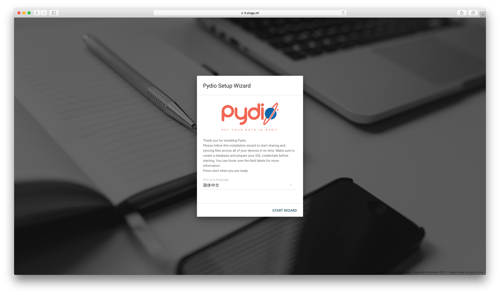
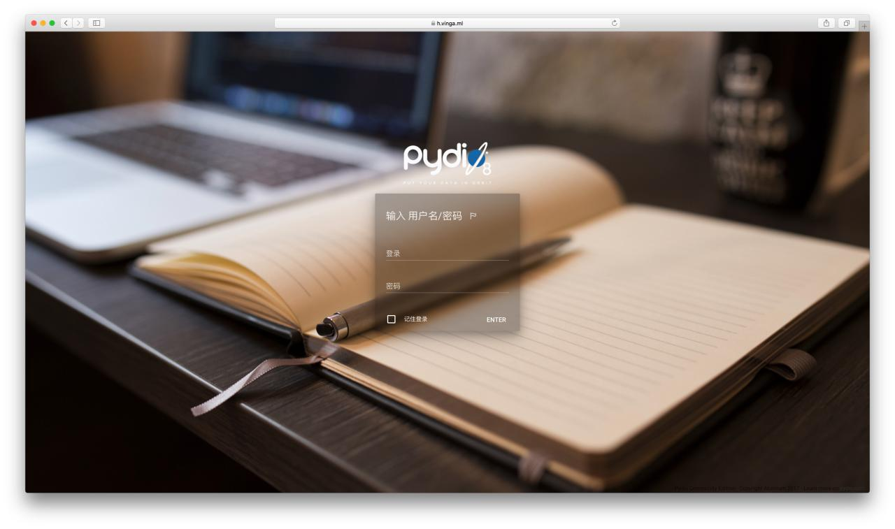

# 运用Pydio搭建精美个人云

> 大家都知道国内的云盘提供商目前来讲只剩下百度云盘.那么除了在线网盘.我们其实还可以用VPS部署一个私人网盘.也就是个人云.今天为大家带来比OwnCloud和NextCloud更加精美的Pydio部署教程

## 准备&注意事项

* **Pydio消耗资源比较高.数据库和前端加起来应该要去掉300MB左右内存.望知悉**
* **Hyperapp**
* **一个已经解析正确的域名（ping验证）**
* **耐心.仔细.认真**

## 在Hyperapp对服务端进行设置

1. **请确保这时候`Nginx Proxy`以及`Nginx SSL Support`正常默认安装并且启动了**
2. **转到商店页面.找到`MariaDB`然后选择服务器并且保存进入配置界面**
3. **转到商店页面.找到`Docker Image`然后选择服务器并且保存进入配置界面**
4. **请确认你完全按照按照下图对两个应用进行了设置.有中文提示的相应修改.其他不要动.**
5. **保存并且进行安装**
   

## 对Pydio进行设置

1. **稍等一段时间等应用都正常启动之后.访问`Pydio`的域名会看到这样一张图**
   
* **前面三个警告是可以忽略的的.因为跟宿主机部署不一样.有些工作放在docker来做了.总之这时候点击绿色的`CONTINUE`即可.**
2. **这里选择简体中文.然后点击开始向导.然后一路配置.先是网站名称.然后是管理员账户创建.**
     
3. **接着来到配置数据库这里.重点来了.按照图片中的提示进行配置.**
   * **注意Host一定要写ip然后后面半角冒号并加上端口.例如`8.8.8.8:8888`**
   * **密码写Pydio数据库密码.不是数据库Root密码.**
      
   4. **然后选择`TEST DB CONNECTION`通过之后一路下一步即可.稍等片刻跳转到登录页面登录即可**
     

## 客户端的使用方法

* **网页版**
  * **网页版的操作其实非常直观.打开网址登陆操作即可.有些可能存在汉化不完整的情况.自行琢磨**
* **iOS**
  * **iOS方面需要在App Store下载购买一个叫做`Pydio Pro`的应用(RMB 6元).那个免费的应用不能连接到我们部署的最新服务端**
  * **iOS连接方法有两个**
    * **方法1:打开登陆网页版之后.会在左边栏看到一个二维码.用手机应用扫描即可.然后填写完密码就可以正常登陆**
    * **方法2:首先先点击一下前缀的`http://`让他变成`https://`.然后填写域名.然后正确填写用户名和密码.再然后点击一下右上角的`√`.稍等片刻.不行就点多两下.成功之后会跳转回主页.点击进入即可**

## 大功告成

* **这时候去访问你的域名吧٩(˃̶͈̀௰˂̶͈́)و**

