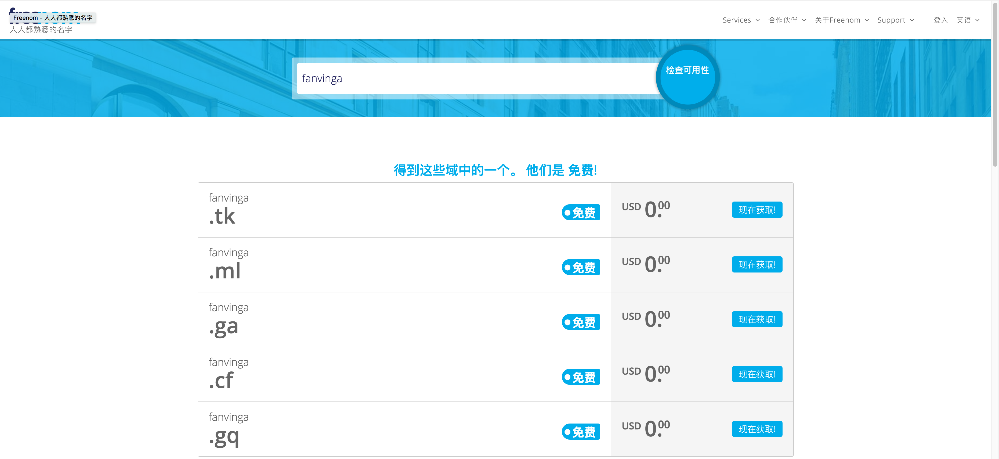
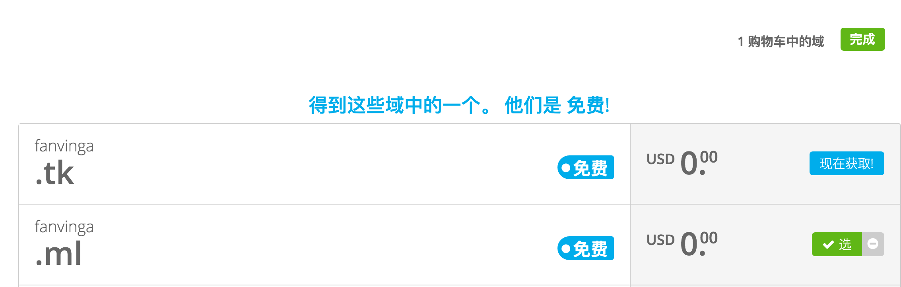
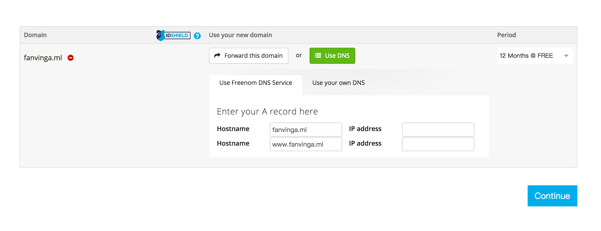
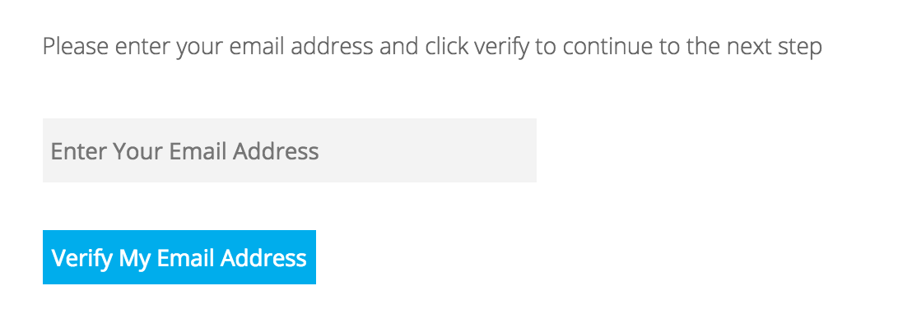
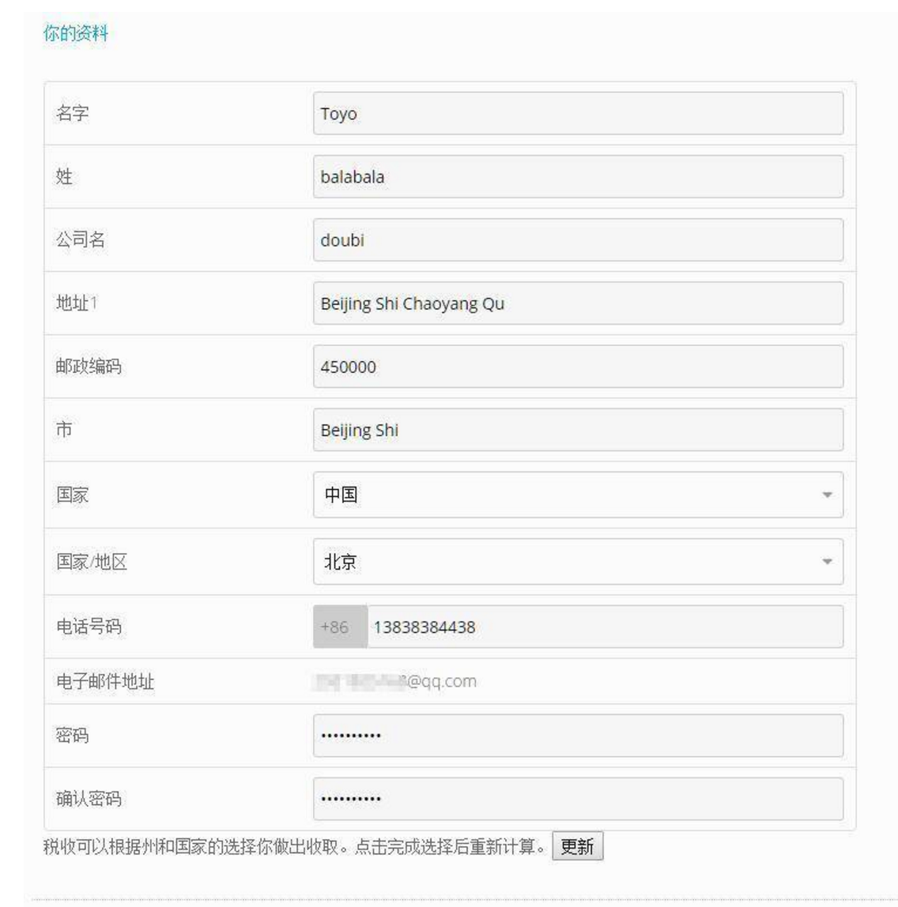

> 在今时今日.拥有一个个人域名已经成为了一种互联网的必需品(笑).言归正传.很多人觉得申请一个域名会是一件复杂而困难的事情.并且可能要花很多钱.那么今天为大家带来一篇免费的个人域名的申请教程。

* **本文原文链接https://vinga.ml/domain**

# 准备

* **一个可以正常接收邮件的邮箱**
* **一个可以访问的IP地址**

# 开始

**首先访问[www.freenom.com](http://www.freenom.com),freenom是一个免费的域名服务商，旗下提供.ML、.CF、.GA、.TK、.GQ四个免费域名的注册。（值得一提的是[www.dot.tk](http://www.dot.tk)也是一家免费域名服务商，提供.tk域名的免费注册，注册的步骤与在freenom中大致相同）然后在屏幕中间输入框输入你想要的域名比如`fanvinga.ml`,然后点击检查可用性**

## 

**然后选中自己喜欢的.点击现在获取.然后右上角购物车完成**

**来到下面这个界面.点击`Use DNS`.然后再点击`Use Freenom DNS Service`.HostName保持默认即可.看得懂的想改也没关系.IP Address填写你想解析的IP.一般来说填写VPS的IP地址即可.记住别忘了选择12个月免费**

**下一步在这里填写你的邮箱.然后选择验证我的邮箱地址.然后从邮箱中打开发过来的链接即可进入下一步**

**在页面填上你的资料,按照相应信息填写即可(最好使用美国的代理然后找一个美国人信息生成器)。记得勾选我已阅读并同意条款和条件.当然填写自己的信息也没有问题.这里给出一个范例**

**接下来的步骤一路下一步.然后登陆的时候使用你的邮箱和刚刚的密码来登陆.稍等片刻即可解析完成.其他更多关于freenom的问题请进入hyperapp的Telegram交流群请教帅气的FanVinga:)**

**注:关于域名有关知识比如顶级域名，二级域名以及域名解析等有关知识简介如下：**

* **域名**

   > 域名（英语：Domain Name），又称网域名称、网域，是由一串用点分隔的名字组成的Internet上某一台计算机或计算机组的名称，用于在数据传输时标识计算机的电子方位（有时也指地理位置）。每个域名都是由标号组成，各标号之间用点（小数点）隔开。比如我们常见的 [www.google.com]( https://www.google.com) 就是一个域名。其中标号“com”是顶级域名，标号google是二级域名，标号www是三级域名。本教程申请的个人域名（基本格式类似domain.com）实际上是二级域名。不过我们可以在二级域名下根据需要划分出许多三级域名，比如a.domain.com,b.domain.com等等。这些三级域名可以根据需要根据不同的解析方式来与服务器的IP地址相联系。

* **域名解析**

  > 域名是为了方便记忆而专门建立的一套地址转换系统，要访问一台互联网上的服务器，最终还必须通过IP地址来实现，域名解析就是将域名重新转换为IP地址的过程。一个域名对应一个IP地址，一个IP地址可以对应多个域名，多个域名可以同时被解析到一个IP地址。域名解析需要由专门的域名解析服务器(DNS)来完成。

* **常见设置**

  > 设置A记录解析即可，这样做可以将你的域名和你服务器的IP地址联系起来。如果在HyperApp中遇到需要使用域名的场景时，我们只需要申请一个免费域名并且将做A类解析，解析到你所使用的服务器的IP地址上即可，解析完成需要等待一段时间生效。一个简单判断解析成功的方法就是使用ping命令来ping自己的域名，如果能够返回你服务器的IP地址即为解析成功。
