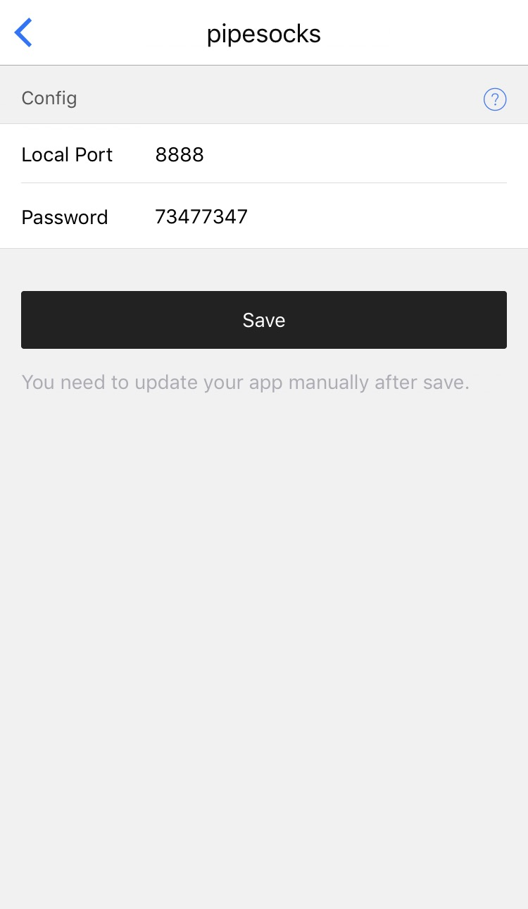
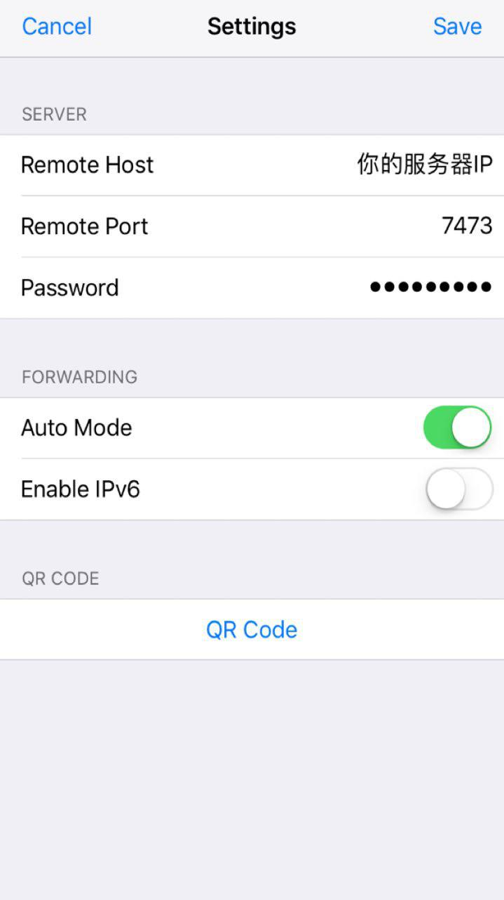
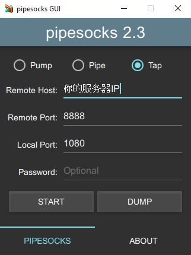

# Pipesocks 教程

简介：Pipesocks 是另一款代理软件（省略），官网 [https://pipesocks.github.io/md/tutorial](https://pipesocks.github.io/md/tutorial)

Pipesocks把爱国上网的过程比喻为Pump(泵)、Pipe(水管)、Tap(水龙头), 一般地，将服务端形容为泵，客户端比喻为水龙头，中间的传输通道比喻为水管。

## HyperApp 服务端配置

首先打开HyperApp在应用中找到Pipesocks,填写相关配置，这里只需要填写"Localport"和"password"即端口和密码即可。


## 防火墙配置

- CentOS
```
firewall-cmd --add-port=端口号/tcp --permanent
firewall-cmd --reload
```
- Ubuntu
```
sudo ufw allow 端口号
```

## 客户端配置

你可以在这里找到一些平台的[客户端](https://github.com/pipesocks/pipesocks/releases/tag/2.3),其中IOS端的下载地址在[这里](https://appsto.re/us/DvFNhb.i)下文以IOS端为例

### Pipesocks 配置（IOS）

打开Pipesocks，点击Settings,填写`服务器IP，端口，和密码`,全部填写完毕之后返回主页面点击袜子图案，黑白袜子变成黄袜子之时代表代理已经开启



### Pipesocks 配置（PC）

在上述地址下载好PC版(.exe文件)之后，双击会自动解压到一个文件夹内，此时进入文件夹打开软件，照如下方式填写后运行即可。



Pipesocks没有全局代理，需要自行配制浏览器代理插件，Chrome浏览器推荐[ProxySwitchyOmaga](https://chrome.google.com/webstore/detail/proxy-switchyomega/padekgcemlokbadohgkifijomclgjgif?utm_source=chrome-ntp-icon),Firefox推荐[Foxyproxy](https://addons.mozilla.org/en-US/firefox/addon/foxyproxy-standard/) 在此不再赘述。

大功告成！
