# 使用HyperApp简单的搭建和管理自己的Minecraft服务器


这篇教程将会告诉你，如何使用HyperApp部署自己的Minecraft服务器，以及如何使用GCP的SSH Web终端来管理服务器的配置。

###### 注意事项

虽然我是用的是Mac，但是教程中的部署部分仅通过HyperApp完成，而服务器的配置使用了GCP提供的Web终端，理论上不存在PC/Mac之间不兼容的问题。

服务器方面我目前仅使用了GCP，并未部署其他的服务商的产品，故无法提供相关教程

### 通过HyperApp部署服务器

1. 首先我们打开自己的HyperApp，然后从`商店`中找到MinecraftServer.
    <!--商店列表图片-->
    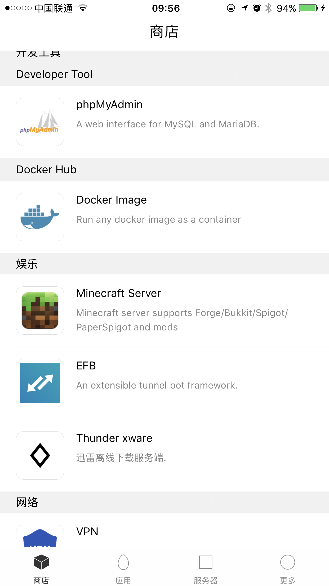
2. 选中自己的服务器，并创建应用
    <!--应用将要指定服务器的图片-->
    
3. 此时会进入一个比较基本的服务器配置界面，从上至下分别为
    <!--配置页面图片-->
    
    >
###### 配置
```
Public Port —— 服务器端口 （链接服务器时使用的端口）
```
###### Game —— 游戏配置
```
    Mode —— 游戏模式
        - creative  —— 创造模式 （如果是建筑服务器，可以使用创造模式）
        - survival  —— 生存模式 （通常选择生存模式）
        - adventure —— 冒险模式 （硬核一点，一旦死亡，角色就不能再被使用这样）
        - spectator —— 观光模式 （虽然没用过，不过应该是当你完成建筑之后，又不想让玩家互动的时候使用的模式吧）
    Difficulty —— 难度
        - peaceful  —— 和平 （不会刷怪）
        - easy      —— 简单
        - normal    —— 普通
        - hard      —— 困难
    Whitelist —— 白名单
    Ops —— 管理员名单
```
###### Server —— 服务器设定
```
    Icon —— 服务器图标 （用URL地址来设定服务器的图标）
    Version —— 游戏版本 （编辑这里来指定你服务器使用的版本，默认为最新版 **LATEST** ）
    Server Type —— 服务器类型 （如果服务器使用Mod，就需要加载Mod的平台，我是用的是FORGE，而且FORGE也是目前使用比较多的Mod加载平台）
        - FORGE
        - SPIGOT
        - BUKKIT
        - PAPER
        - FTB
```
###### Volumes —— 目录
```
    Data    —— 数据目录（默认就行，这个目录决定了你的服务器相关文件被存储在你远端机器的位置）
    Mods    —— 模型目录（默认为Data/mods）
    Config  —— 配置目录（默认为Data/Config）
    Plugins —— 插件目录（默认为Data/plugins）
```

4. 本教程中，我们采用 `生存模式`+`简单难度` 的默认配置，点击下一步，会从自己的应用目录中看到创建好的应用，默认状态应该是**尚未安装**。
    <!--应用列表尚未安装的图片-->
    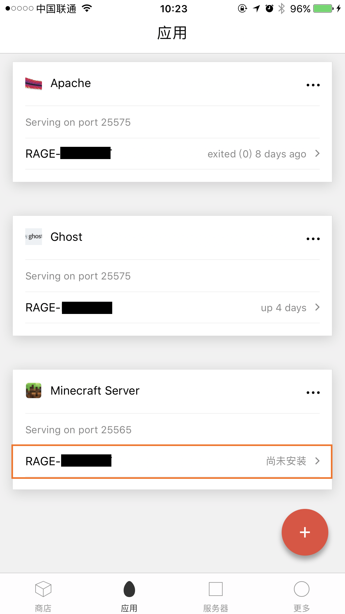
5. 点击方框弹出选项，选择安装
    <!--选择安装前图片-->
    
6. 等待应用安装完成之后，此时的状态应该显示为 **up xxx seconds** ，即服务运行了多长时间

> 到这一步，你的Minecraft的服务器就已经架设完成了，此时如果使用的是正版的Minecraft，就已经能链接服务器开始玩了，但是很多玩家使用的并不是正版MC，所以接下来将会告诉你如何使用GCP的Web管理终端来进行一些重要的配置，从而让盗版游戏也能链接到自己的服务器。

### 使用GCP的Web终端进行服务器配置

> ###### 注意事项
> - 使用Web终端进行管理的时候，因为要链接Google控制中心，所以（绝大部分几率）要使用科学上网
> - 原则上，这种管理方式不推荐在移动端上进行操作，请尽量使用PC / Mac进行管理
> - 后半段教程可能需要一丢丢的编程基础，不过按着操作应该也不会有什么问题
> - 关于终端指令，请注意，`$` 符号仅作为命令的标记，不需要输入，例如`$ ls`命令，仅需要输入`ls`即可

1. 首先访问自己的[实例管理页面](:https://console.cloud.google.com/)
2. 选择自己的VM实例
    <!--VM实例选择截图-->
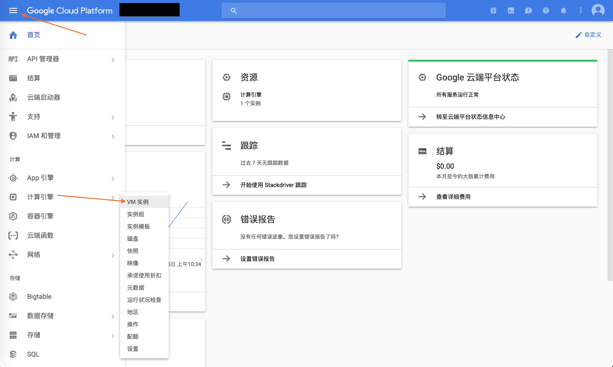
3. 在浏览器窗口中打开SSH
    <!--SSH Web终端载入页面截图-->
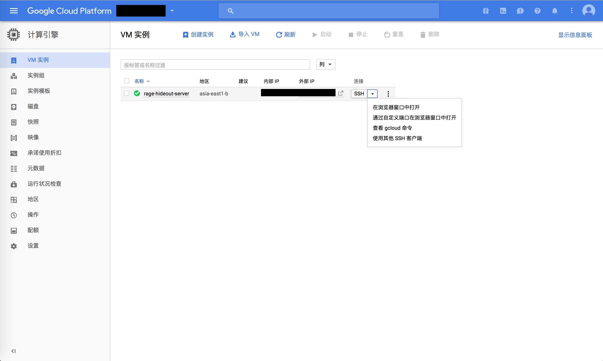
4. 经过短（实际上看网络状态）时间的等待之后，你会看见这个页面
    <!--Web 终端起始页面-->
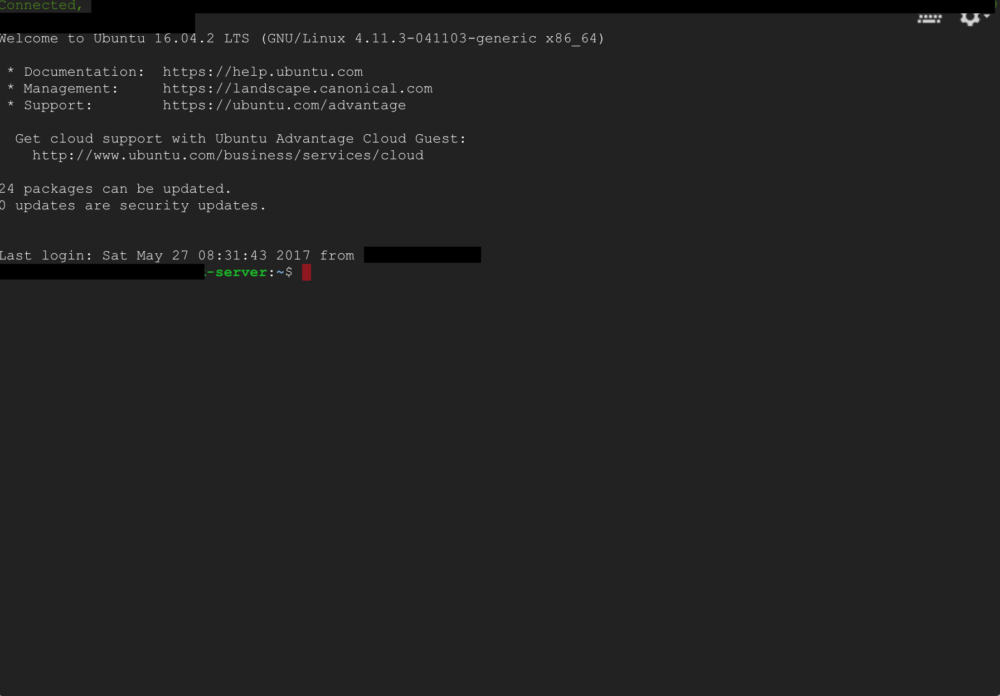
5. 此时，我们**可以**使用root身份来进行后续操作，**也可以**在必要的时候进行`$ sudo`操作，本教程中，将会使用root身份进行操作
6. 首先我们使用命令 `$ sudo -i`进入root身份，此时可以注意到终端变化
    <!--sudo -i-->
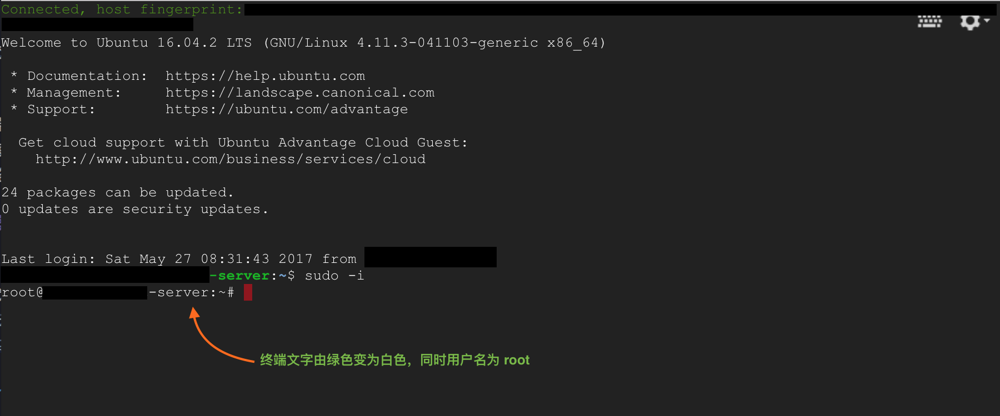
7. 然后我们进入Minecraft的服务器存放目录，由于使用的是默认配置，所以命令应该是一样的.

        $ cd /..
        $ cd srv/docker/Minecraft-Server/
8. 此时我们就已经进入了Minecraft服务器的目录，通过`$ ls`命令，可以看到服务器有这些文件
    <!--ls列表截图-->
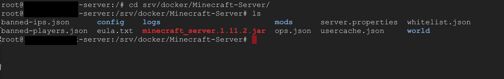
9. 我们需要配置的文件是`server.properties`，在这里，使用`vim`命令来编辑这个文件 （使用`vim`完全是因为我觉得这个比较顺手，如果有编程基础知道其他命令的并不一定要用`vim`）

        $ vim server.properties

10. 此时终端会进入`vim`模式，应该显示成这样
    <!--VIM界面截图-->
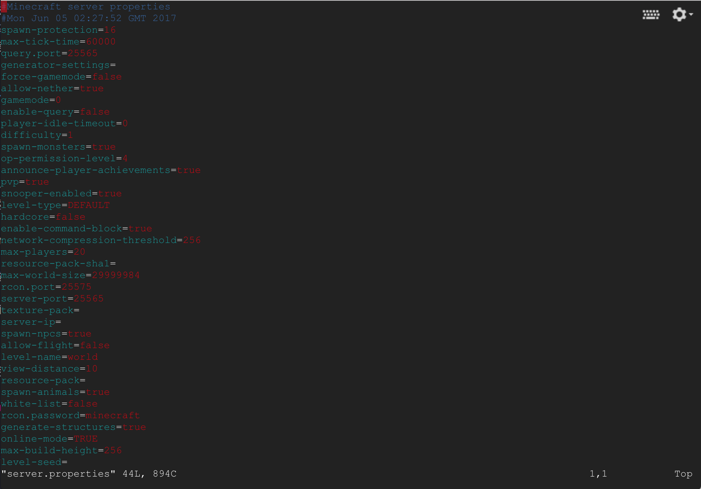
11. 如果想使用盗版MC链接服务器，那么服务器需要关闭正版验证，在键盘上按下`i`键进入`INSERT`模式，注意低端文字的变化
    <!--INSERT截图-->
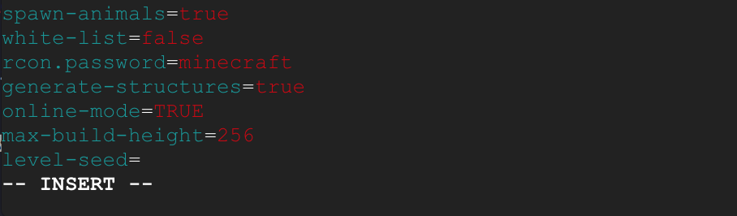
12. 我们需要修改的地方是这里，将`online-mode=`的`TRUE`更改为`false`来关闭正版验证，用`方向键`移动光标，把
    <!--online-mode=TRUE-->
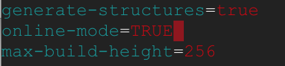
改成
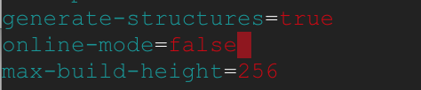

    <!--online-mode=false-->

13. 按下键盘上的`ESC`键，并输入`:wq`来保存，并退出编辑器
    <!--:wq-->
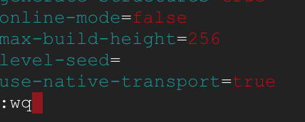
14. 此时我们的终端配置就完成了，输入`$ exit`退出root身份，此时会显示`logout`，然后再次输入`$ exit`来退出编辑
    <!--Logout-->
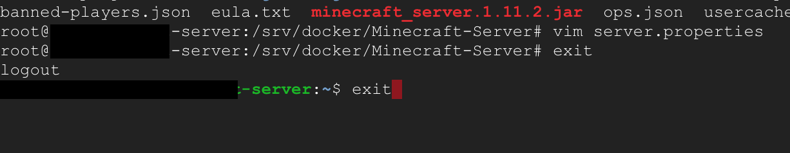
> 退出编辑之后窗口会自动关闭，此时web终端的管理就结束了。初级教程中不对server.properties进行过多介绍。

### 利用HpyerApp重启服务器，并应用新的配置

> 通过web终端进行管理之后，需要在HyperApp中对Minecraft服务器进行重启，以应用新的配置

1. 首先我们选择`应用`里面的服务器，然后点开菜单
    <!--菜单界面-->

2. 选择`重启`，然后等待重启完毕即可

### 其他事项
> - Minecraft服务器默认使用25565端口作为服务端口，同时使用25575作为rcon管理端口，但是本教程中，我们不使用rcon进行管理。
> - 如果链接服务器之后，提示 `name = null` 这个错误，说明你没有关闭正版验证，请回顾教程
> - 如果关闭了正版验证，还是无法链接服务器，请检查防火墙是不是没有设置25565端口的通信，设置方法[看这里](https://github.com/waylybaye/HyperApp-Guide/blob/master/Guide/across-wall.md#设置-gce-防火墙)
> - 请注意客户端版本和服务器版本一致性的问题，版本不一致也可能会导致链接问题


