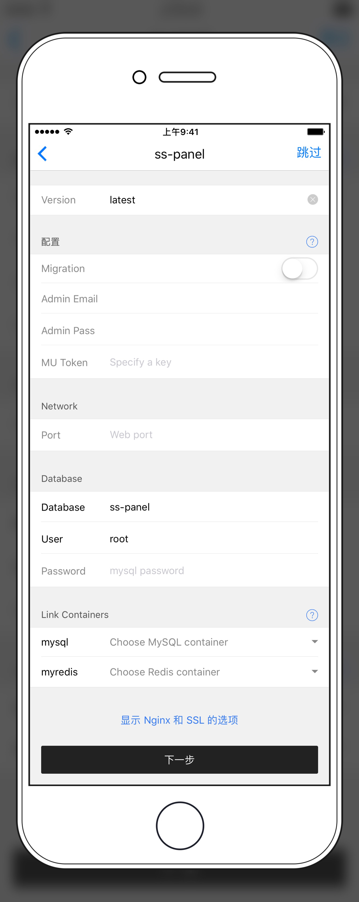

# SS-Panel 安装教程

## 服务器安装

### 安装依赖

* MySQL
* redis

注意，如果你是第一次安装 MySQL，可以在安装界面数据库那里填一个数据库 `ss-panel` 这样就会自动创建一个数据库。否则你需要用 `phpMyAdmin` 或者手动创建一个数据库给 `ss-panel` 用。

### 安装 ss-panel

* Migration: 第一次安装时需要选中该选项，告诉 `ss-panel` 运行后初始化表格和数据。
* Admin Email/Pass: 创建一个管理员账号。
* MU Token: MU api token (可选）
* Port: 选择一个端口（如果你用nginx 反代这儿可以不填）
* Database：数据库名字
* User: 数据库用户
* Password 数据库密码

Link Containers:
* mysql: 选择一个 MySQL 应用（必选）
* redis: 选择一个 redis 应用（必选）

然后安装即可！

