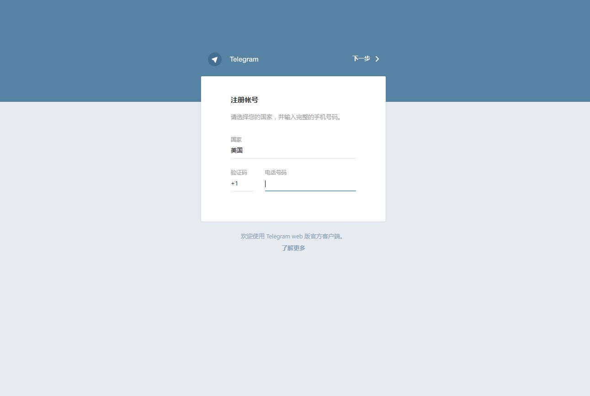

# Telegram Web 教程

简介：Telegram Web是利用Telegram官方API实现的自托管的网页版Telegram客户端，其地位类似于微信网页版与微信客户端

## 申请Telegram API

首先Google搜索关键如下图的关键词，点击第一个结果


进入网页之后点击箭头所示的"Getting Started"


再点击"API Development Tools"


再填写完手机号成功登陆之后选择"Getting my application",填写完相关信息即可得到API，其中我们将要用到的是api_id和api_hash


## HyperApp 服务端配置

- 在安装`Telegram Web`前，需要先安装`Nginx Proxy`和`Nginx SSL Support`,它们俩的参数不需要变动。

- 首先打开HyperApp在应用中找到Telegram Web,填写相关配置：

```
"Api_id"和"Api_hash"            填写刚才申请到的值 
"Hostname"                      填写你的域名 
"Port"                          填写你的端口(注意此端口不要和Nginx监听的80和443端口冲突，此处我们选择8888端口为例) 
```

- 再展开"Show Nginx and SSL options"选项

```
"Custom Domain"                 填写你的域名
"Port"                          填写的和上面端口一致的端口，本例为8888
"HTTPS"                         推荐选择"Redirect http to https"
```

- 再来到"Nginx SSL Support"选项下

```
"Domain"                        填写你的域名
 "Email"                         填写你的邮箱
```
全部填写好的示意图如下：


## 防火墙配置

- CentOS
```
firewall-cmd --add-port=80/tcp --permanent
firewall-cmd --add-port=443/tcp --permanent
firewall-cmd --reload
```
- Ubuntu
```
sudo ufw allow 80
sudo ufw allow 443
```

## 使用Telegram Web

打开浏览器，键入你的域名，回车即可看到Telegram Web的页面



输入手机号码和其他客户端一样登陆即可开始聊天。

大功告成！
