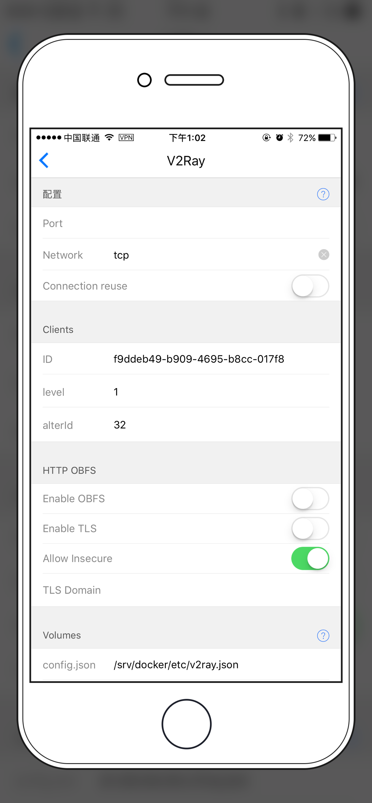

# V2Ray VMess 以及 HTTP & TLS 教程

简介：V2Ray 是另一款代理软件（省略），官网 [https://www.v2ray.com/](https://www.v2ray.com/)

## HyperApp 服务端配置

### 应用配置及安装

* Port: 端口
* Network: 选择一种传输方式
    * tcp 使用 TCP 连接
    * kcp 使用 UDP （可能会被运营商 QoS）
    * ws 使用 WebSocket
* Clients
    * ID: 会自动生成一个 UUID
    * level: 信任级别，默认为1
    * alterID: 默认32，注意客户端的 UUID 和 alterID 必须保持一致

只填上面这些的话就已经可以用了，如果你需要更高级的配置请看下面：

* HTTP OBFS
    * Enable OBFS: 开启 HTTP 混淆
    * Enable TLS: 开启 TLS1.2
    * Allow Insecure: 是否允许不安全的TLS连接
    * TLS Domain: SSL 证书的域名
* Volumes
    * config.json: 生成的 V2Ray 配置文件会存在这里
    * SSL certs: SSL 证书的存放位置

### TLS 证书设置

如果你开启了 TLS 就需要填一个 `TLS Domain` 并且在上面 `SSL certs` 目录下面放两个文件

* `domain.com.crt`
* `domain.com.key`

可以使用自签名的证书，当然你也可以用 `Nginx Proxy` 和 `Nginx SSL Support` 自动生成可信的 SSL 证书。只要在 `V2Ray` 下面的 `Nginx 和 SSL 配置` 中输入 `TLS Domain` 就可以自动生成 SSL 证书了！
    

---

## 客户端配置

你可以在这里找到所有平台的客户端 [V2Ray 各平台客户端下载](https://www.v2ray.com/chapter_01/3rd_party.html) 下文以 Mac 客户端 V2RayX 为例

### V2RayX 配置

在 `V2RayX → Servers` 中添加一个服务器，如图：

* Address: 填入你服务器的地址 和 HyperApp 中设置的端口
* UUID: HyperApp 中的 UUID 
* alterId: HyperApp 中的 alterID
* Security: 随便选，推荐默认选项
* Network: 选择 HyperApp 中配置的选项，默认为 TCP

#### HTTP 混淆 配置

点击左下角的 `tranport settings` 选择 `TCP` 如图 `header type` 选择 `http` 即可开启 http 混淆

#### TLS 配置

点击 `TLS` 标签页，选中 `Use TLS` 如果你是自签名证书也同时选中 `Allow Insecure`

大功告成！

