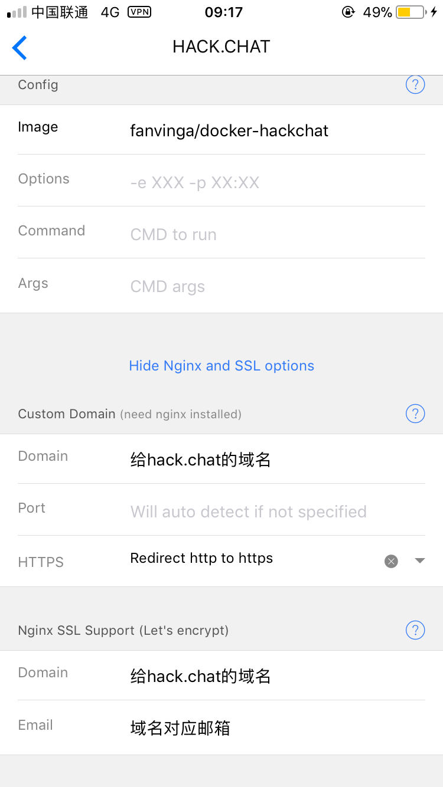

# 搭建HACK·CHAT即时通信平台

> 有时你需要临时发送一些比较隐私的东西.又不想直接在聊天软件中直接发送.这时候维护一个轻量的即时通信平台就派上用场了.只要在url后面随便加上一个单词就能创建你的会话.非常方便.

## 本文原文地址 https://vinga.ml/chat

## 准备

* **Hyperapp**
* **一个已经解析正确的域名（ping验证）**
* **耐心.仔细.认真**

#### 到Hyperapp进行设置

1. **转到商店页面.找到Docker Image然后选择服务器并且保存进入配置界面**
2. **请完全按照下图配置进行填写！**
   
3. **保存并且进行安装.请确保这时候Nginx Proxy以及Nginx SSL Support正常默认安装并且启动了**

## 大功告成

* **这时候去访问你的域名吧٩(˃̶͈̀௰˂̶͈́)و**

## 吐槽一下
* **说实在的这个docker..可能是我做过的坑最多的..不说别的..官方源码clone下来不能用你敢信🤦‍♂️为了只开放一个端口.并且用上https.我在docker内部封了一个nginx作为websocket的转发代理.希望大家用的开心**

## 写在最后

* 写了这么久.如果能有所收获那就是我最大的荣幸了:)
* 如果可以的话.可以关注一下 https://vinga.ml 这是我的私人博客地址:)
* 如有问题可发邮件至我邮箱fanalcest@gmail.com联系或telegram@fanvinga

