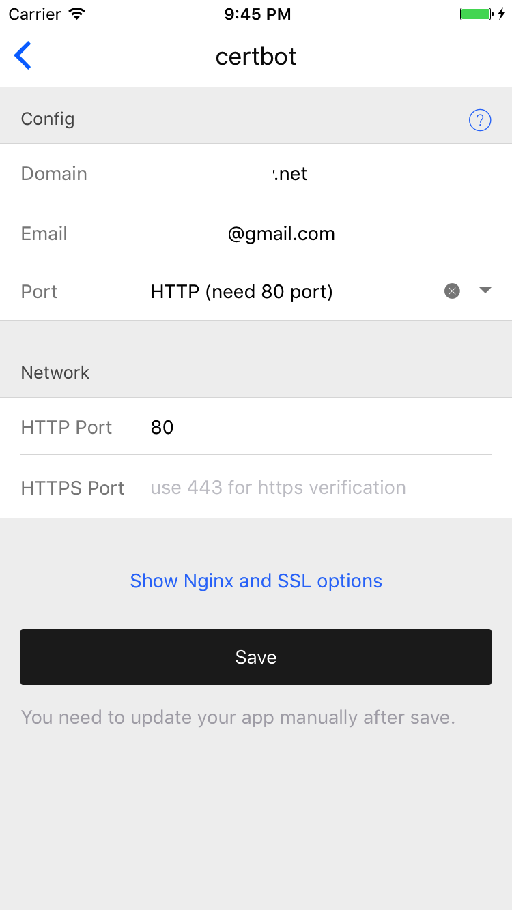

# 使用 Certbot 自动获取可信 SSL 证书 (LetsEncrypt）

使用 `Nginx Proxy` 和 `Nginx SSL Support` 也可以自动生成证书，但是那个需要常驻 `80,443` 端口，而 `certbot` 只需要运行一次，运行完就会释放 80或者443端口。

注意事项：
1. 在获取证书前您需要先将域名解析到您的服务器上面，否则域名所有权验证会失败
2. LetsEncrypt 只支持 80,443 端口验证，其它端口都不行

## HyperApp 应用配置

* Domain: 填入你想获取证书的域名，多个域名用英文逗号分隔开
* Email: 您的邮箱
* Port：选择验证方式，HTTP 使用 80 端口验证，HTTPS 使用 443 端口验证
* Network
    * HTTP Port: 如果你上面选择 HTTP 验证，那么这儿填入 80
    * HTTPS Port： 如果上面选择 HTTPS 验证，那么这儿填入 443

配置完成后，点击安装即可，程序会自动运行，并且获取证书，几乎可以马上成功。

### 验证是否成功

首先可以看应用日志，成功后，应用日志里面会显示将证书保存到了某个目录。这时候去 `/srv/docker/certs` 下面你会看到 `域名.crt` 和 `域名.key` 文件。

### 添加新域名

如果你需要添加更多的域名证书，只要在域名中用英文逗号分隔多个域名，更改后点击 `更新配置` 重新运行即可。

### 更新证书

等到 90 天你的证书快到期时，LetsEncrypt 会向你发送通知邮件，这时候只要找到这个应用再启动一下就可以了，会自动更新证书！

