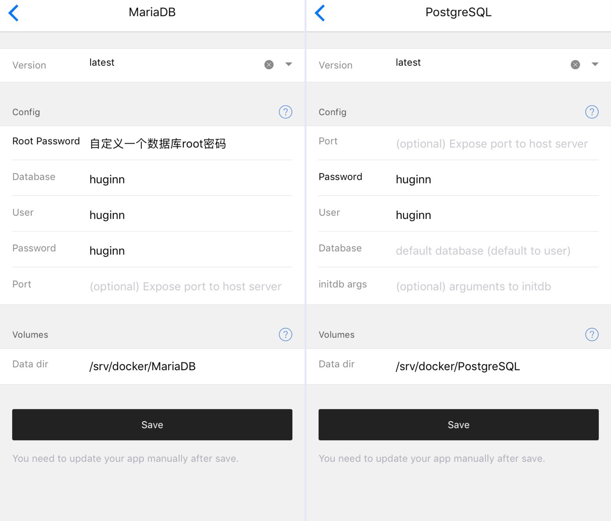

# 搭建Huginn构建自动化信息流

> Huginn是一个神器，见到它有一种相见恨晚的感觉，我们都知道IFTTT是一个信息的触发器，可以用来建立自动的工作流。而Huginn是IFTTT的加强版，几乎可以将所有的信息进行重组、变形、输出，真正做信息的主人。

## 本文原文地址 https://vinga.tech/huginn

## 准备工作

  *  Hyperapp
  *  解析正确的域名（ping验证）
  *  耐心耐心耐心

## 数据库部署

   1. wordpress的必选依赖为`PostgreSQL`和`MariaDB`. 可选依赖为`Nginx Proxy`以及`Nginx SSL Support`.如果不选用这两个.需要配置Port.然后通过 http://VPS的IP:端口 来访问.本教程默认已经正确安装并启动这两者.
	
  2. 按照下图对`PostgreSQL`以及`MariaDB`进行设置.注意除了有中文提示的选项.其他都应该保持跟图片一致以免出错.
	
  
  3. 设置完成之后选择保存配置并安装即可.  
	
## Huginn服务端部署

  1. 按照下图对`Huginn`服务端进行设置.注意除了有中文提示的选项.其他都应该保持跟图片一致以免出错.

  

  2. 设置完成之后选择保存配置并安装即可.  

## 注意事项

  * 注意.部署完启动访问域名可能会提示502.请稍等一会.`Huginn`的启动需要时间.五分钟之后尚且报错才考虑启动失败.
  * 初始登录用户名为`admin`密码为`password`

## 大功告成！

  * 现在.去访问你的`Huginn`吧:)
  * 这里放一个已经部署成功的截图:)
    

