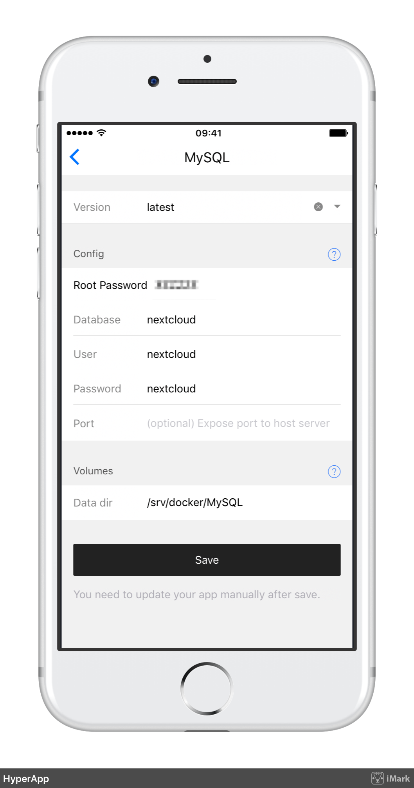
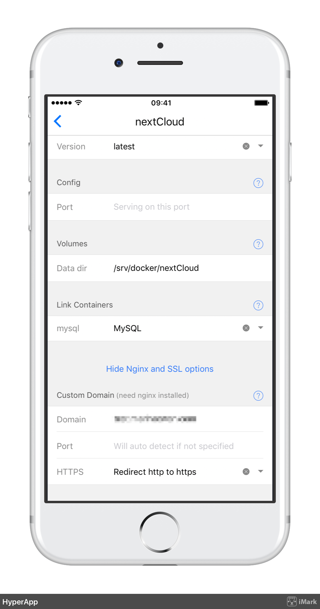
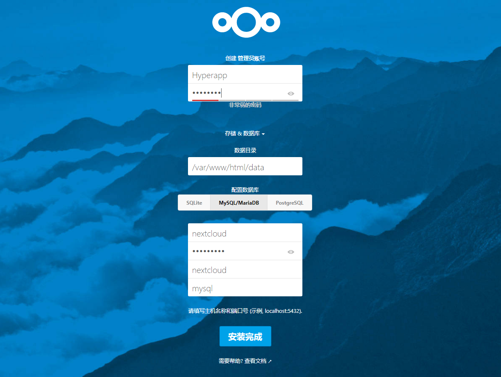
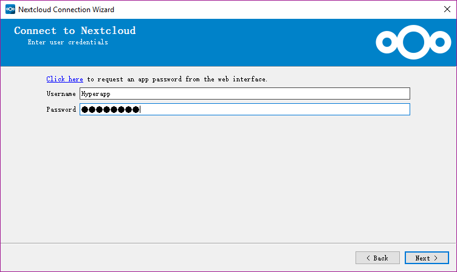
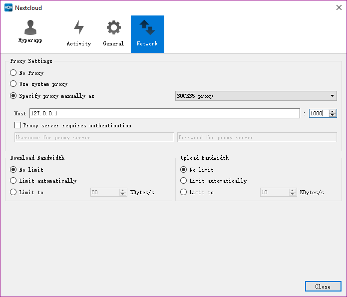

# Nextcloud 教程

## 简介 

>随着国内多家网盘的陆续关停、百度云盘的严重限速、将小电影替换成8秒教育片等等，国内网盘不是阉割就是残废，真的让人寒心，在找不到能放心使用下去的云服务时，我们的数据该怎么办呢？相对简单靠谱的方案有购买 Office 365 用微软的 OneDrive、番·羽·土·啬使用国外的 Dropbox、Google Drive 等、或者购买 NAS 设备。当然，如果你有动手能力，那么还可以用自家/公司的电脑或租用 VPS 服务器来「搭建自己的私有云网盘」！除了介绍过的ownCloud、Syncthing 外，新一代的开源网盘 Nextcloud 同样值得推荐.

下面简要介绍以下安装流程

## HyperApp 服务端配置

- 在安装`Nextcloud`前，需要先安装`Nginx Proxy`和`Nginx SSL Support`和`Mysql`,前两个的参数不需要变动。（如果之前已经安装了则可不用安装）

### Mysql设置：

- 首先打开HyperApp找到Mysql安装，填写相关配置：

```
	 "Version"             选择"latest"
	 "Root Password"       设置一个Mysql的"Root密码"
	 "Database"            设置一个数据库名,此处示例为"nextcloud"
	 "User"                设置一个数据库用户,此处示例为"nextcloud"
	 "Password"            设置一个数据库密码,此处示例为"nextcloud"
	 "Port"                此处`留空`
```

- 其他设置如未说明则保持默认

- 填写完成之后点击最下方的"保存"

- Mysql 配置完成后如下：



### Nextcloud 设置：

- 首先打开HyperApp在应用中找到Nextcloud,填写相关配置：

```
	 "Version"             "latest"
	 "Port"                此处"留空"
	 "Data dir"            保持默认
	 "Link Containers"     选择"Mysql"
```

- 再展开"Show Nginx and SSL options"选项

```
	 "Custom Domain"       填写"你的域名"
	 "Port"                此处"留空"
	 "HTTPS"               推荐选择"Redirect http to https"
```

- 再来到"Nginx SSL Support"选项(如果你之前已经通过HyperApp申请好证书则此步骤不需要填写)

```
	 "Domain"      填写你的"域名"
	 "Email"       填写你的"邮箱"
```

- 填写完成之后点击最下方的"保存"

全部填写好的示意图如下：



## 防火墙配置

- CentOS

```
	firewall-cmd --add-port=80/tcp --permanent
	firewall-cmd --add-port=443/tcp --permanent
	firewall-cmd --reload
```

- Ubuntu

```
	sudo ufw allow 80
	sudo ufw allow 443
```


## 使用Nextcloud

打开浏览器，键入你的域名，回车即可看到nextcloud的页面,首先我们需要初始化，设置一个账户。



等待初始化完成后，用刚刚创建的账户登陆进去即可。


大功告成！

## 客户端教程

### 客户端下载

客户端下载地址如下，如果链接失效请前往[此处](https://nextcloud.com/install/)到页面右下角下载

- [Windows & Mac & Linux](https://nextcloud.com/install/#install-clients)
- [Android](https://play.google.com/store/apps/details?id=com.nextcloud.client)
- [IOS](https://itunes.apple.com/us/app/nextcloud/id1125420102?mt=8)

### 客户端的使用

以Window客户端为例，下载之后进行安装，然后打开。

在server address中填写你的域名，然后点击下一步


然后输入刚才创建的用户名和密码



然后上面选择相关的设置参数，比如同步大小到多大时通知用户，默认500M，按照自己需求设置，下面选择本地文件夹，选好之后点击完成。


- 此时配置完成，客户端会最小化到任务栏同时可以看到客户端和云端已经可以看到开始了自动同步，你可以打开所设置的本地文件夹，在里面放一个文件，它便会自动同步到云端。

大功告成。



## 后续配置

如果你想要自己配置相关参数，在右下角通知栏打开Nextcloud然后进行设置即可，这里贴上一个设置代理的方法。

```
打开Nextcloud
选项卡选择"Network"
在代理设置(Proxy Settings)中 选择"手动指定代理"(Specify proxy manually as)为 "socks5"
"Host"填写"127.0.0.1"，右侧的方框是填写端口的，一般填写"1080"
```


然后代理即设置完毕，点击关闭即可。

