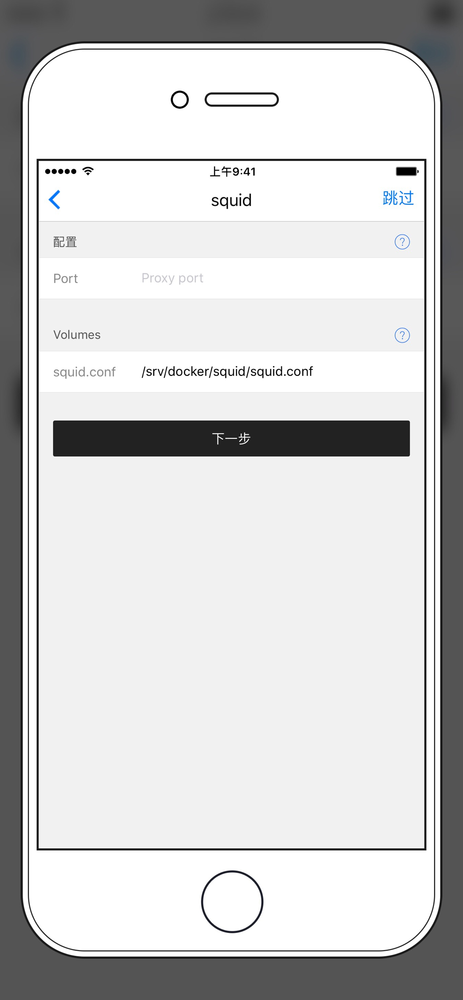

# 使用 nghttpx 搭建 HTTP2 代理

nghttpx 是一个 HTTP2 代理，HTTP2 是新一代的 HTTP 协议，但一些老牌的 HTTP 代理比如 squid 并不支持 HTTP2 协议，就需要 nghttpx 来将 HTTP2 协议翻译成 HTTP1.x 的协议，所以要搭建一个HTTP2 代理你需要一个 HTTP 代理来配合使用。（可以用商店中的 squid）

具体请求流程是：

| 国内网络 | 墙 | VPS | 自由网络 | 目标网站
| --- | :---: | --- | :---: | --- |
| 你的浏览器 |  → （加密）HTTP2 → | nghttpx → squid | → HTTP(S) → | 目标网站 |

## 服务器安装和配置

### 配置 squid


在商店中选择 `squid` 并创建，无需填写任何选项安装即可（端口也不用填，因为squid配置好后默认监听在本地的3128端口）。

**注意，如果 Squid 无法启动，日志中显示 `FATAL xcalloc: Uable to allocate ***` 时，这是内存不足引起的错误。你可以尝试添加交互分区来解决。

```sh
sudo su
fallocate -l 1G /swapfile
chmod 600 /swapfile
mkswap /swapfile
swapon /swapfile
echo "vm.swappiness = 10" >> /etc/sysctl.conf
sysctl -p
```

注意重启后swap会取消挂载.请根据相应系统查询写入fstab的命令.这里给出Ubuntu和Centos的

Ubuntu:`echo '/swapfile none swap sw 0 0' | sudo tee -a /etc/fstab`

Centos:`echo "/swapfile swap swap defaults 0 0" | sudo tee -a /etc/fstab`

然后**卸载重装** Squid 即可。


### 配置 nghttpx


SSL 证书的获取你可以参考 [如何自动生成可信的SSL证书](./SSL.md)，如果使用自签名证书你需要在客户端导入CA。

* Port: 代理端口，一般默认为443。
* Disable TLS: 是否禁用 TLS，不禁用的话就必须填写 SSL 参数以及提供 SSL 证书。**默认为不禁用，一般不打开此开关**。
* Domain: SSL 证书的域名
* Backend: 后端 HTTP 代理，如果你下面link 了一个 backend（本教程中连接上文创立的squid应用），这里就填 `backend,端口号`，如果你使用其它远程代理，这里就填代理地址就行，格式 `地址,端口`，比如使用了类似的其他软件，假如它监听在本地的10000端口，则此时应该填写`127.0.0.1，10000`。同时Link Containers 一栏留空。
* Access Log: 是否在日志中显示访问记录
* Volumes - certs: SSL 证书的存放目录，应该包含上面所填写的 Domain 的两个文件: Domain.key 和  Domain.crt，（证书和私钥按格式匹配，只需保证目录下分别存在以.crt和.key为后缀的两个文件即可）。
* Link Containers - backend: 这儿可以选择上面创建的 squid，如果不使用squid而使用其他软件，则此栏留空。

安装即可，然后你就有一个非常安全的 HTTPS 代理了。开始配置客户端吧。

## 客户端

### Chrome

Chrome 支持HTTP2，可以使用 Proxy SwitchyOmega 来使用

点击Proxy SwitchyOmega，单击“选项”，左侧菜单选择“新建情景模式”，模式名称随意，模式类型选择“代理服务器”并点击创建。在右侧，代理协议选择https,代理服务器填写你的域名，端口填写你在nghttpx设置的端口。保存即可使用

### Surge

```
http2s = http, my.server.com, 443, Squid用户名, Squid密码, tls=true
```


