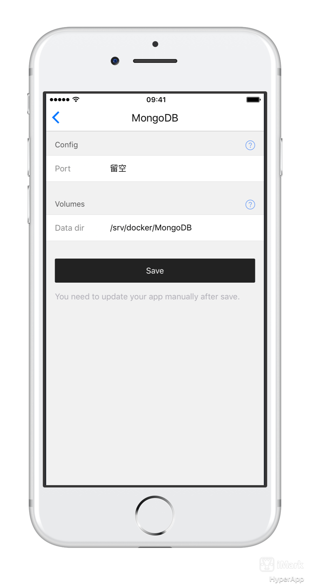
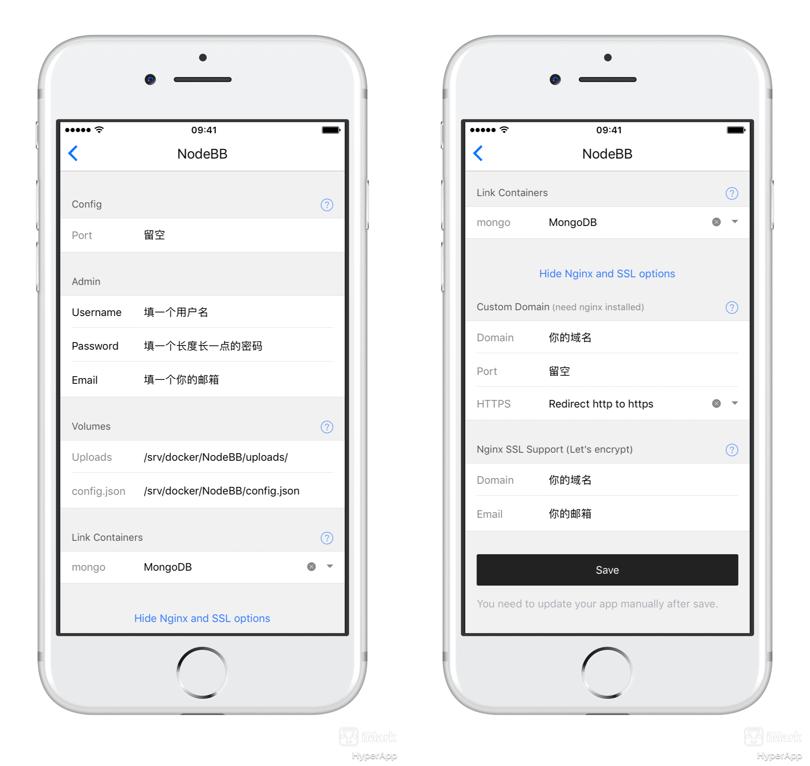
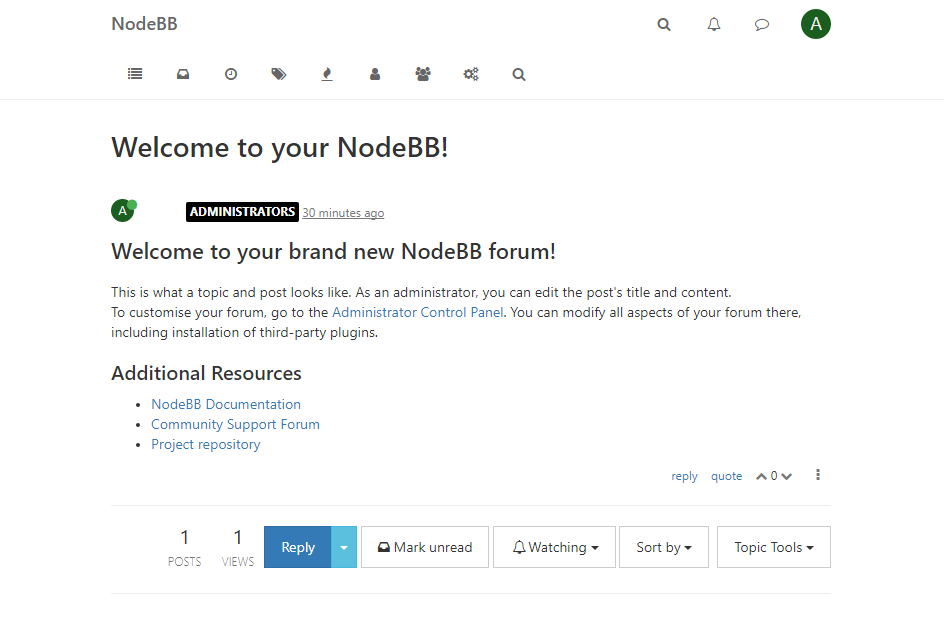

# NodeBB 教程

## 简介 

>NodeBB是一款由NodeJS开发的论坛应用。它神速的单页面设计，它有完善的功能模块，不仅可以用作论坛，还可以用作 CMS，博客，论坛，甚至电子商务网站；它使用了 websocket 实时通信，可以让用户分组建群聊天；它的模块化设计，从主题到功能插件均可以自定义，支持 theme, widget, plugin 三种形式的扩展，社区已经有了很多功能强大的扩展； 它有比较完善的 wiki 和颇受欢迎的社区关注度

## 主要流程

	1. 安装`Nginx Proxy`
	2. 安装`Nginx SSL Support`
	3. 安装`MongoDB`
	4. 安装和配置`NodeBB`

## HyperApp 服务端配置

- 在安装`NodeBB`前，需要先安装`Nginx Proxy`和`Nginx SSL Support`和`MongoBB`,它们三个的参数不需要变动。（如果之前已经安装了则可不用安装）

Nginx相关的配置不再赘述，下面贴出MongoDB的配置图



### 配置NodeBB 

	* "Port" 留空即可
	* "Username" 填一个用户名
	* "Password" 填一个密码
	* "Email" 填一个邮箱
	* "Uploads" 保持默认
	* "config.json" 保持默认
	* "Link Containers" 选择`MongoDB`

- 再展开"Show Nginx and SSL options"选项

	* "Custom Domain"填写你的域名
	* "Port" 留空即可
	* "HTTPS"推荐选择"Redirect http to https"

- 再来到"Nginx SSL Support"选项下

	* "Domain"填写你的域名
	* "Email"填写你的邮箱

全部填写好的示意图如下：



## 防火墙配置

- CentOS
```
firewall-cmd --add-port=80/tcp --permanent
firewall-cmd --add-port=443/tcp --permanent
firewall-cmd --reload
```
- Ubuntu
```
sudo ufw allow 80
sudo ufw allow 443
```

## 使用NodeBB

打开浏览器，键入你的域名，回车即可看到NodeBB的页面,注册好之后进如即可开始聊天。

BodeBB主页面如下


我们右上角登陆后随便点击一个帖子



## 注意

- 管理员密码应该设置得复杂一些，并注意妥善保管
