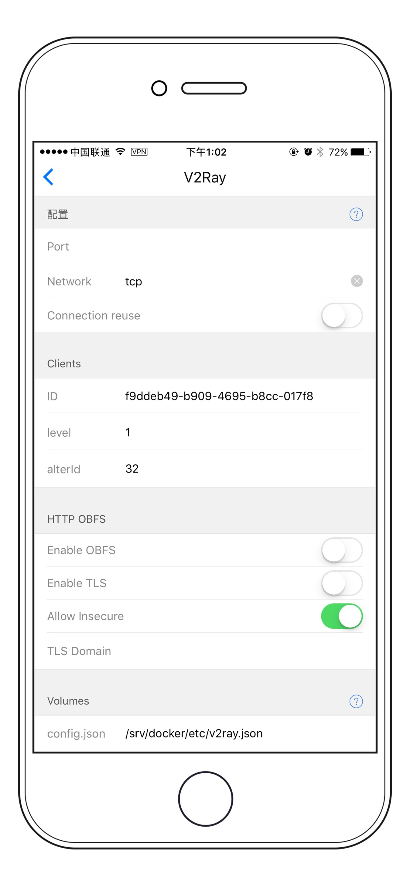
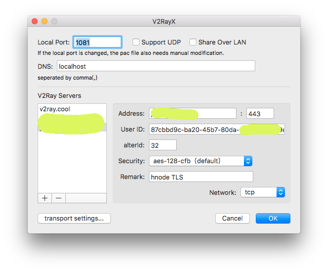
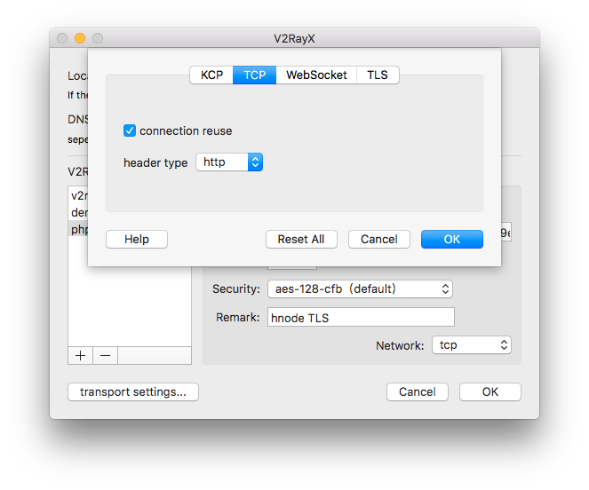
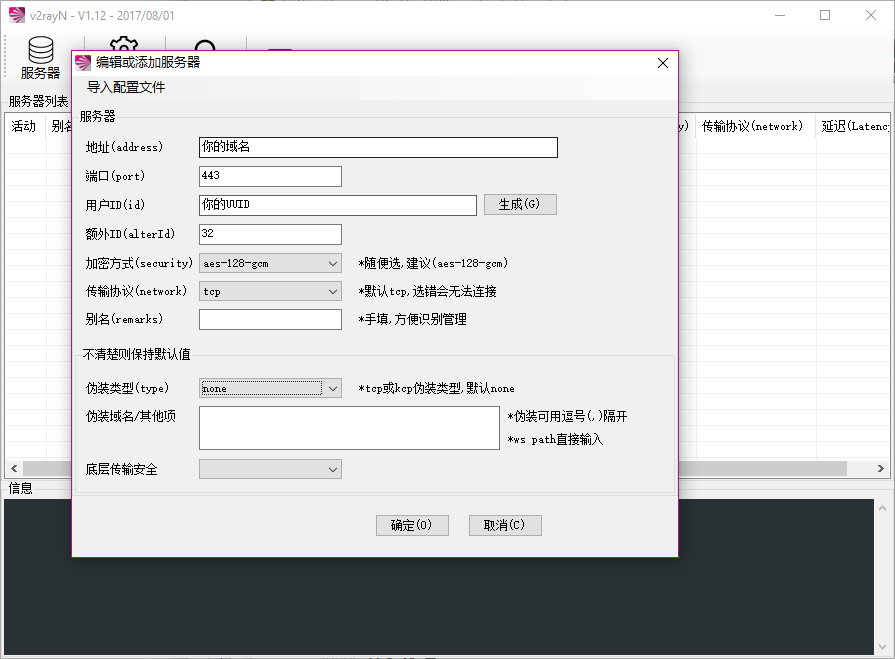
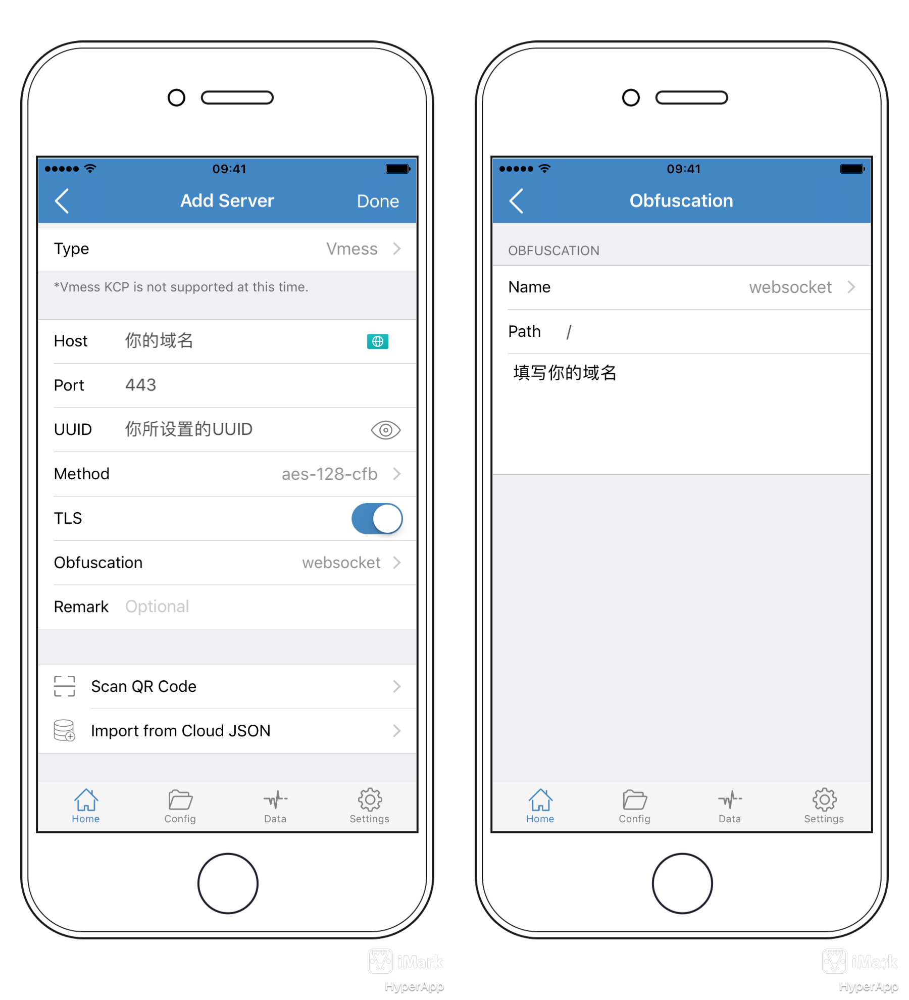

# V2Ray 教程

简介：V2Ray 是另一款代理软件（省略），官网 [https://www.v2ray.com/](https://www.v2ray.com/)

目录
* 背景知识
    * TCP 模式
    * WebSocket 模式
    * mKCP 模式
* V2Ray 服务端配置
    * 方案1: 使用 TCP 传输，并开启 TLS
    * 方案2: WebSocket 传输，使用 Nginx & SSL Support 反代 V2Ray
* 客户端配置
    * macOS V2RayX

----

### 背景知识

V2Ray 共有三种传输方式，可以形成三种使用方案：

#### TCP 模式 （支持 TLS）

使用TCP来传输，这种方式和其它代理应用模式上差不多。TCP 模式可以使用 HTTP/TLS 混淆来模拟 HTTP 网站流量，但也只是模拟，并不是真实的 HTTP 流量。

#### WebSocket 模式 （支持 TLS）

WebSocket 是一种在 HTTP 之上的协议，本质也是TCP传输，但是是天然的 HTTP 网站流量。并且可以搭配各种 HTTP 服务器（比如nginx,caddy）一起使用。

因为 WebSocket 已经是 HTTP 的一种，所以并不需要任何伪装（混淆）。

#### mKCP 模式

使用 `UDP` 来传输，mKCP是以流量换速度，就是多倍发包，我同一份数据发多份，防止丢包重传，所以同一条件下使用mKCP会比其他方式耗费更多流量，不建议手机4G使用。

由于BT下载、游戏、以及视频聊天等也都是使用 UDP 传输，所以这种模式下可以伪装成 `BT下载流量、FaceTime 流量、微信视频流量`。

由于 BBR 是 TCP 加速技术，所以使用 mKCP 并不能享受 BBR 的加速buff，不过 mKCP 本身就是一种加速技术了，也并不需要 BBR。

---

## HyperApp 服务端配置

### 应用配置及安装



```
* Port:             填一个端口
* Network:          选择一种传输方式
    * tcp           使用 TCP 连接
    * kcp           使用 UDP （可能会被运营商 QoS）
    * ws            使用 WebSocket
* Header:           选择一种混淆模式
    * none          不使用混淆
    * tcp http:     使用 http 混淆（需要上面选择 tcp）
    * kcp ****:     这几个都是kcp的混淆方式，需要上面选择 kcp
    * 注意 ws (WebSocket) 本身就是 HTTP 所以不用也不能选择混淆方式
* Clients
    * ID:           会自动生成一个 UUID
    * level:        信任级别，默认为1
    * alterID:      默认32，注意客户端的 UUID 和 alterID 必须保持一致
* TLS
    * Enable TLS    开启 TLS 1.2 加密（混淆）
    * TLS Domain    SSL 证书的域名，将会自动在下面 `SSL certs`
                    目录下面寻找证书文件。
* Volumes
    * config.json   生成的 V2Ray 配置文件会存在这里
    * SSL certs     SSL 证书的存放位置
```

----


## 方案1: 使用 TCP 传输，并开启 TLS

### TLS 证书设置


#### 1. 已经有证书

1. 选中`Enable TLS` 并在 `TLS Domain` 中填写您的域名
2. 在上面 `SSL certs` 对应的目录下面放两个域名同名的文件:

* `domain.com.crt` 如`bing.com.crt`
* `domain.com.key` 如 `bing.com.key`


#### 2. 使用 Nginx 自动生成新的 SSL 证书

1. 先安装 `Nginx Proxy` 和 `Nginx SSL Support`
2. 先关闭上面的 `Enable TLS` 选项（否则没有证书 V2ray 启动不起来），点击 `安装`
3. 等几分钟证书生成了后，重新打开配置页面，开启 `Enable TLS` 选项，然后点击 `更新配置`。


#### 3. 使用 certbot 自动生成新的 SSL 证书

1. 参考 [certbot 的教程](../developer/certbot.md) 来生成 SSL
2. 选中 `Enable TLS` 选项，并且填入 `TLS Domain`
3. 保存并安装


关于如何自动生成可信证书的更多介绍，请参考 [如何自动生成 SSL 证书](../SSL.md)


## 方案2: WebSocket 传输，使用 Nginx & SSL Support 反代 V2Ray

这个方案会自动配置 Nginx 来反代 V2Ray，达到完美伪装。结合 Nginx SSL Support 还能自动生成可信的 LetsEncrypt 证书。这个方案 TLS 是在 Nginx 层面实现的。

首先参考 [如何自动生成 SSL 证书](../SSL.md) 依次安装 `Nginx Proxy` 和 `Nginx SSL Support` 然后在上面的配置页面中，Nginx 和 SSL 选项按下面填写：


**注意，使用此模式时，443 端口是分配给 Nginx 的，你要为 V2Ray 随便设置另外一个端口，但客户端连接时使用443**


### 自定义域名
* 域名：填写您的域名
* 应用端口：**填写上一段中设置的端口**
* HTTPS: 默认会将 HTTP 重定向到 HTTPS，建议选择不重定向，这样客户端就可以随便选需不需要TLS了。

### SSL 选项
* 域名：填写您的域名，默认与上面一样
* 邮箱：填写您的邮箱

然后安装即可，安装完毕稍等几分钟 Nginx SSL Support 将会自动生成可信的 LetsEncrypt 证书。接下来就配置客户端连接即可。

关于如何自动生成可信证书的更多介绍，请参考 [如何自动生成 SSL 证书](./SSL.md)


## 方案3: 使用mKCP 传输

mKCP是V2ray对KCP的简单实现，是基于UDP的一种传输方式，它可以伪装成FaceTime视频通话，BT下载和WeChat视频聊天等流量，一般搭配动态端口来实现较为完美的伪装，动态端口HyperApp后续将会支持，此处暂以单端口为例。

### 配置选项
* Port:		填写您的端口
* Network:	选择"kcp"
* Header:	"kcp utp","kcp srtp","kcp wechat-video"三选一

其他设置保持默认即可，安装完毕后记得打开防火墙对应的UDP端口。

----


## 客户端配置


你可以在这里找到所有平台的客户端 [V2Ray 各平台的图形客户端介绍](https://www.v2ray.com/chapter_01/3rd_party.html)

但是主流平台依然有以下推荐的方案：

* **MAC** [V2RayX](https://github.com/Cenmrev/V2RayX/releases)
* **PC** [V2rayN](https://github.com/v2ray/v2rayN/releases)
* **IOS** [Shadowrocket](https://itunes.apple.com/us/app/shadowrocket/id932747118?mt=8)
* **IOS** [Kitsunebi](https://itunes.apple.com/us/app/kitsunebi/id1275446921?mt=8)
* **Android** [V2rayNg](https://play.google.com/store/apps/details?id=com.v2ray.ang&hl=en)

## MAC 客户端

### V2RayX 配置（Mac）

在 `V2RayX → Servers` 中添加一个服务器，如图：



* Address: 填入你服务器的地址 和 HyperApp 中设置的端口
* UUID: HyperApp 中的 UUID
* alterId: HyperApp 中的 alterID
* Security: 随便选，推荐默认选项
* Network: 选择 HyperApp 中配置的选项，默认为 TCP

#### HTTP 混淆 配置

点击左下角的 `tranport settings` 选择 `TCP` 如图 `header type` 选择 `http` 即可开启 http 混淆


#### WebSocket 配置

如果你使用 WebSocket 则打开 WebSocket 选项卡，填写选项即可。其实不用改，默认选项就行。


#### TLS 配置

点击 `TLS` 标签页，选中 `Use TLS` 如果你是自签名证书也同时选中 `Allow Insecure`


## PC 客户端

>使用 PC 客户端之前你还需要[在此下载](https://github.com/v2ray/v2ray-core/releases)一个核心程序的压缩包,然后解压缩。再把下载好的V2rayN程序和核心程序放在同一个文件夹

### V2RayN 配置

在`V2rayN→服务器`中添加一个服务器，如图



* 地址(Address): 填入你服务器的地址
* 端口(Port)：HyperApp 中的 端口，本例程为443
* 用户ID(id): HyperApp 中的 UUID
* 额外(alterId): HyperApp 中的 alterID
* 加密方式(Security): 随便选，推荐默认选项
* 传输协议(Network): 选择 HyperApp 中配置的选项，默认为 TCP

#### HTTP 混淆 配置

点击下方的`伪装类型` 选择 `http` 如图 `伪装域名/其他项` 填写所要伪装的域名，用逗号隔开即可开启 http 混淆


#### WebSocket 配置

如果你使用 WebSocket 则上方的`传输类型` 选择 `ws`，`伪装类型`选择`none`,`伪装域名/其他项`填写WS的路径，除非特别指定，一般留空。


#### TLS 配置

如果你需要启用TLS，那么点击 `底层传输安全` 选项卡，选中 `TLS` ，上述介绍的任意方式都可以开启TLS。

## IOS 客户端

### Shadowrocket 配置

在右上角中添加一个服务器，类型选择`Vmess`，并依次填写以下内容

* HOST: 填入你服务器的地址
* PORT: 填入在HyperApp 中的 端口
* UUID: HyperApp 中的 UUID
* Method: 默认选项

#### HTTP 混淆 配置

点击下方的`Obfuscation` ,进入二级页面，`Name`选择 `http` .`Path` 保持默认，`下面的大方框` 填写所要伪装的域名，用逗号隔开即可开启 http 混淆


#### WebSocket 配置

点击下方的`Obfuscation` ,进入二级页面，`Name`选择 `Websocket` .`Path` 保持默认，`下面的大方框` 填写`你的域名`，用逗号隔开即可开启 http 混淆



#### TLS 配置

如果你需要启用TLS，那么右滑打开在主设置页面的`TLS`开关，上述介绍的任意方式都可以开启TLS，在本例程中已经打开TLS。

### Kitsunebi 配置

在右上角中点击“+”，类型选择`Vmess`,并依次填写以下内容

* Address: 填入你服务器的地址
* Port: 填入在HyperApp 中的 端口
* Password/UUID: HyperApp 中的 UUID
* Security: 保持默认即可
* Network: 选择你所配置的方式，本文以WS为例
* WS Path: 填写你的WS的路径，一般此处为空。
* TLS: 右滑勾选
* Allow Insecure: 建议勾选


---

大功告成！
