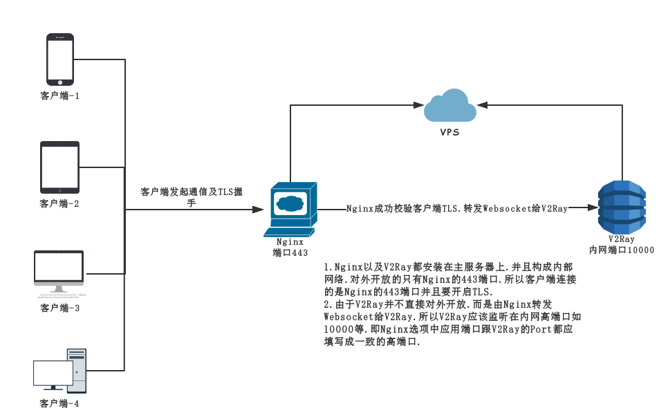
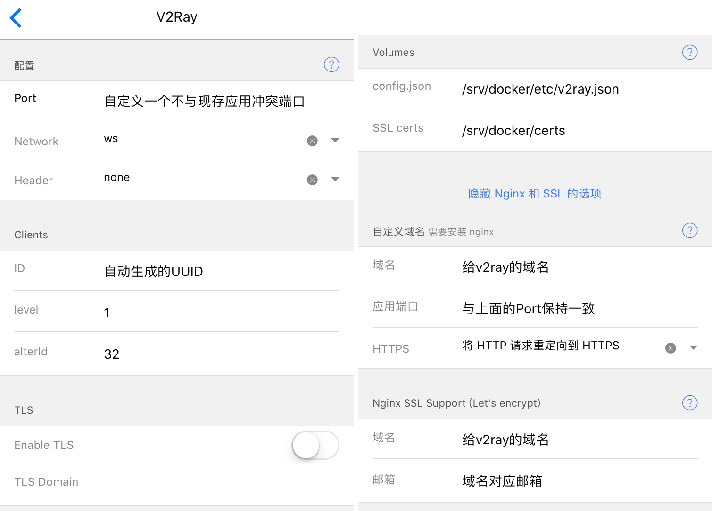

# V2Ray完美混淆教程（内含全平台客户端配置教程）


> **在国际形势如此严峻的今天.配置一个完美混淆的工具是非常有必要的.今天我们就来讲解.如何使用V2Ray配置websocket并且使用Nginx反向代理挂靠TLS证书**


### 本文原文链接为 https://vinga.tech/v2ray 原文更新更为及时

## 重要说明

* **从现在开始.所有技术支持请联系付费.我能确保教程没有问题.按着来肯定可以成功.除此之外不做任何说明**


## 更新记录
* 2017.12.01:修改了方法一的命令部分.更直观.
* 2017.10.22:增加了完美融合页面的部分
* 2017.10.12:修改了win客户端部分
* 2017.10.1:增加了网络拓扑部分.
* 2017.08.10:Replace the introduce of server setting.
* 2017.07.28:增加了一直相加但是懒癌发作没加的mac版config.json
* 2017.07.28:增加了安卓和win端客户端的链接并且调整了小火箭的图片排版
* 2017.07.27:增加了安卓端和win端的设置.并且与ios端并列


## 网络拓扑



## 工具

* **HyperApp**
* **Mac/Win**
* **耐心**

## 准备工作

* **首先先按照之前的获取顶级域名教程.拿到属于你自己域名.并且将域名解析到VPS上面去.请确保解析正确后再进行以下步骤.如果已经有域名了直接进入下一步**
* **使用HyperApp安装`Nginx Proxy`以及`Nginx SSL Support`.保持默认配置即可.如有发生端口冲突则自行排查.Nginx的端口请不要修改.否则可能导致无法连接的问题(仅限于本教程范畴)**

## 配置V2Ray服务端（方法一）

### 方法一的由来

> 一直以来.虽然v2ray有完整的tls实现等等好处.但是一直有个小缺陷就是访问证书域名会有一个`bad request`的提示.虽然也可以用错误跳转的方法跳转到正常页面.但毕竟不是原来的域名.今天给出一个真正完美的办法

1. **按照我博客别的任何一个方法部署一个用``Nginx Proxy``反向代理的网站.我比较建议是[H5AI](https://vinga.tech/h5ai).确定可以正常访问之后走下面板的步骤.**

2. **按照下图去部署一个V2Ray.注意不要开启TLS.不要展开Nginx选项.除了端口56789和UUID别的都不要动.** 

3. 按照中文提示修改好命令.然后**一整段所有字符**粘贴到SSH里面执行.只修改前面三行有中文的.后面不需要修改.

```
VPS_IP=你的IP
V2Ray_Port=V2Ray的端口
DOMAIN=目标域名
echo "proxy_http_version 1.1;
proxy_set_header Upgrade \$http_upgrade;
proxy_set_header Connection \"upgrade\";
proxy_redirect off;
proxy_set_header Host \$http_host;
if (\$http_upgrade = \"websocket\" )
   {
      proxy_pass http://${VPS_IP}:${V2Ray_Port}; 
    } " > /srv/docker/nginx/vhost.d/${DOMAIN}_location
```

4. **执行没有问题之后.点击`Nginx Proxy`选择重启.稍等片刻.先访问网页确定没有问题.然后按照下面的客户端连接照常链接.记得开启TLS.端口连接443.**

## 配置V2Ray服务端（方法二）



* **配置完后安装即可**


## 配置客户端连接

### 通用

* **注意保证客户端的ID以及alterID和服务端保持一致(在之后版本的HyperApp会添加多用户支持)**
* **注意选择网络类型为Websocket**
* **地址要填写你的域名.端口是443(也就是你的`Nginx Proxy`里面SSL Port请保持默认443不要更改.更改会导致出错)**

### ios&Mac

* **小火箭设置为以下选项即可正常连接**(**如果已经升级到2.1.13及其以上版本.混淆参数中不需要填写混淆域名**)
  
* **如果你的代理工具是surge的话.配置文件请参考给出的config进行修改.默认开放127.0.0.1:10000作为本地socks代理端口并且将收到流量全部转发给vps.然后使用`/path/to/v2ray —config=/path/to/json`来启动本地v2ray.具体运行请到 https://www.v2ray.com/chapter_01/install.html 自行了解**
* **surge设置连接本地socks代理地址为127.0.0.1:10000即可**

 ```json
  {
    "log": {
      "loglevel": "warning"
    },
    "inbound": {
      "protocol": "socks",
      "listen": "0.0.0.0",
      "port": 10000,//这里要填写你打算在本地开放的socks代理端口
      "settings": {
        "auth": "noauth",
        "udp": true,
        "timeout": 30
      }
    },
    "inboundDetour": [],
    "outbound": {
      "protocol": "vmess",
      "settings": {
        "vnext": [
          {
            "address": "", //这里填写你分配给v2ray的域名
            "port": 443, //这里填写Nginx SSL的端口默认是443
            "users": [
              {
                "id": "",//这里填写的是你的UUID也就是一大长串的那个
                "alterId": ,//这里填写的是HyperApp里面配置的alterID.默认32
                "security": "aes-128-gcm"//这里选择一个加密方式.不了解这个请不要改.个人推荐这个
              }
            ]
          }
        ]
      },
      "streamSettings": {
        "network": "ws", 
        "security": "tls",
        "tlsSettings": {
      "serverName": "",//这里还要填写你分配给v2ray的域名
      "allowInsecure": false
       },
        "wsSettings": {
          "connectionReuse": true,
          "path": "" 
        }
      },
     "mux":{
         "enabled": true,
         "concurrency": 8
  }
  }
  } 
 ```
### 安卓&Win

* **安卓请下载V2rayNG程序(http://t.cn/R9U7Xl9 GooglePlay地址),开启后点选+,选择手动输入,并按照下列表格进行配置**
* **win则下载安装V2rayN(https://github.com/2dust/v2rayN/releases/download/1.17/v2rayN.exe).按照如下表格填写添加配置.如果有问题请自行Google客户端教程**
* **另外.win添加完配置之后正确启动了v2rayN并且没有报错之后.请让你的浏览器或者应用程序连接本地127.0.0.1:1080这个地址的socks代理.具体教程请根据你的程序/浏览器自行查找**

|  配置选项  |                   配置内容                   |
| :----: | :--------------------------------------: |
|   别名   |               自定义自己看的顺眼就行                |
|   地址   |               你给v2ray分配的域名               |
|   端口   | 443(也就是你的`Nginx Proxy`里面SSL Port请保持默认443不要更改.更改会导致出错) |
|  用户ID  |        HyperApp里面的uuid(也就是最长的那一串)        |
|  额外ID  |        填写HyperApp里面alterID(默认32)         |
|  加密方式  |          默认就可以(个人推荐aes-128-gcm)          |
|  传输协议  |                    ws                    |
|  伪装类型  |          none(下面一行tcp伪装域名留空不写)           |
| 底层传输安全 |                   tls                    |

 

 <a href="https://vinga.tech"></a>