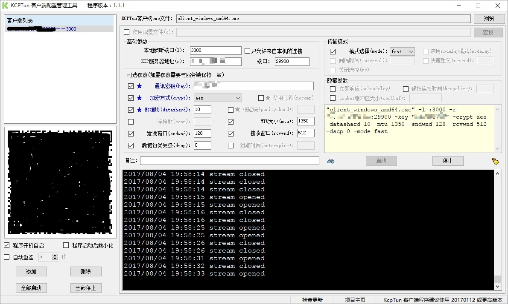

# 使用 kcptun 加速其它网络服务

Kcptun 是一个非常简单和快速的，基于 KCP 协议的 UDP 隧道，它可以将 TCP 流转换为 KCP+UDP 流。而 KCP 是一个快速可靠协议，能以比 TCP 浪费10%-20%的带宽的代价，换取平均延迟降低 30%-40%，且最大延迟降低三倍的传输效果。服务端和客户端都需要安装特定软件。其需要配合其它软件来实现代理功能。（本教程中很多涉及端口的地方都有一个 : 英文冒号，配置过程中千万不要省略）


*image from https://github.com/xtaci/kcptun/*


## 服务端


配置信息：
* Listen Port: 填入一个端口，格式为 `:端口号` 注意冒号不可省略，可以填入默认值 `:29900`
* Target Addr: 要加速的端口，格式为 `IP:端口号`，此处填写你的 SS/SSR/V2Ray 等端口号，IP 可以使用 `127.0.0.1`，例如 `127.0.0.1:443`
* Key: 输入一个密码，kcptun 客户端连接时用
* Crypt: 加密方式，默认 `aes`
* Mode: 默认 `fast`

下面的都是可选参数，其实根据线路情况、你的运营商情况可能需要设置不同的值来达到最佳效果。此文不会教你如何设置这些值，先使用默认参数来配置。

在服务上安装即可,安装完成后进入防火墙配置阶段

## 防火墙配置

### 开启UDP端口

- RedHat/CentOS/Fedora
  ```
  firewall-cmd --add-port=KCP侦听的端口/udp --permanent
  firewall-cmd --reload
  ```
- Debian/Ubuntu

  ```
  sudo ufw allow KCP侦听的端口
  ```

防火墙配置完成后，进入客户端配置阶段

## 客户端配置

### 下载 kcptun

在 [kcptun Releases](https://github.com/xtaci/kcptun/releases) 页面下载最新版的 kcptun，Mac 选择 `kcptun-darwin-amd64-*` 其它系统根据CPU选择程序包。


### 运行 kcptun 命令行

将上面的文件解压后，在同级目录运行里面的 `client_*`

```bash
./client_darwin_amd64 --remote 你服务器IP:上面的端口 --key 密码 --crypt 上面的加密 --mode 上面的Mode -l :一个本地端口
```

你需要注意最后的 `本地端口`，在上面的命令中是 `冒号:端口号` 的形式，下面的设置只需要其中的端口号

### 运行 kcptun 图形客户端

运行图形客户端只需要填写几个关键的参数，kcp服务器地址填写你服务器的IP，端口填写上面的端口，本地侦听端口填写shadowsocks客户端在本地所建立的端口，其他设置根据上文的设置修改，配置完成后如下：



### 配置 SS/SSR/V2ray 等客户端

现在你需要更改你的 SS/SSR/V2ray 等客户端的配置，不需要改其它参数，只要把 IP 改成本机 IP（127.0.0.1） 把端口改成上一步的 `本地端口号` 就可以了！


享受高速吧！

