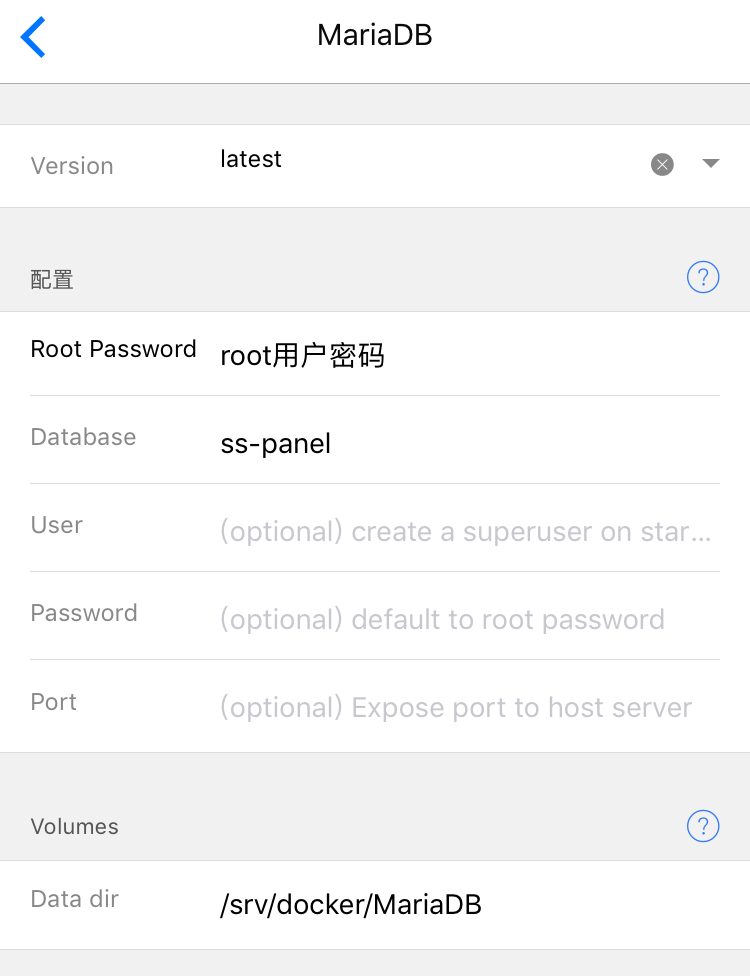
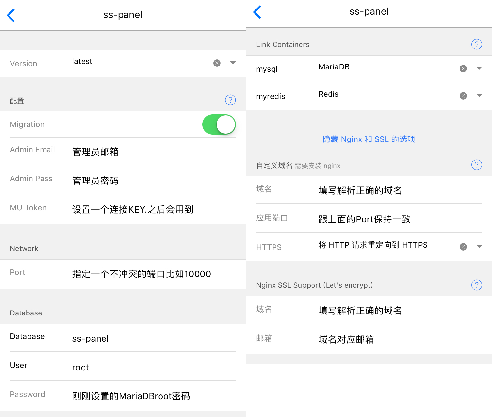
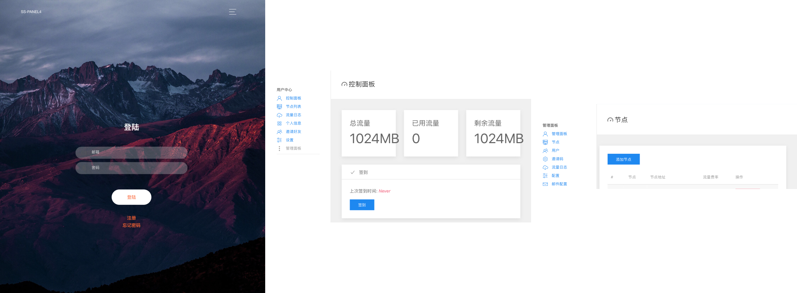
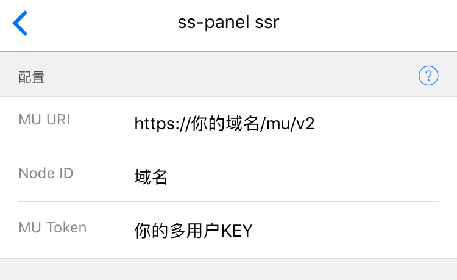

# SSPANEL轻松搭建教程

> 有时候出于要分享爱国线路.或者想对线路进行全自动化管理的时候.用hyperapp一个个进行部署可能稍显麻烦.~~逼格也不够高~~今天给大家介绍sspanel的搭建方法

## 本文原文链接为 https://vinga.fun/panel 本篇不一定为最新版本

## 请完整仔细认真阅读完本教程再动手！

## 流程介绍

1. **配置安装数据库（MySQL/MariaDB+Redis）**
2. **配置安装sspanel前端**
3. **登陆管理面板增加节点**
4. **配置安装sspanel后端**
5. **大功告成**

## 准备工作

1. **已经默认安装好Nginx以及Nginx SSL Support的Hyperapp**
2. **耐心耐心耐心**

## 配置安装MariaDB数据库

* **此处使用MariaDB进行配置.选用MySQL配置完全一样.根据个人喜好选择**
* **请确保你填写的内容跟图片完全一致（除root密码）**
  
* **配置好数据库就可以点击保存然后安装了.但是安装要注意.由于数据库镜像比较大下载需要一定时间.请耐心等待安装完毕才切换应用.**

## 配置安装Redis数据库

* **商店中找到Redis.使用默认配置进行安装如图保持默认配置.**
  
* **保存之后就可以安装了.同样耐心等待**

## 配置安装SSPANEL前端

* **商店中找到`sspanel`并选择服务器.进入设置界面**
* **按照下图中的提示来填写.没有提示的地方请保持跟我一样**
  
* **mysql和myredis两个要选择对应的已经启动的mariadb和redis应用**

## 登陆后台进行节点配置

1. **等待Nginx自动签发好证书之后访问你的panel.**
2. **右上角更多选择登陆.填写Admin邮箱和Admin密码登陆.进去之后左边点击管理面板进入后台.再点击节点来到节点添加**
   

3. **节点地址填写后端的ip地址.有域名的话填写域名也可以.节点名字和信息任意自定义**
* **注意添加节点这一步一定要在部署后端之前.因为要获取NODEID.后端需要这个ID来连接**
4. **添加完毕之后第一栏的`#X`那个X就是我刚才说的ID.**

## 配置安装SSPANEL后端

* **商店里面找到`sspanel ssr`选择服务器并且进入设置页面并按照下图配置.**
* **MU URL的完整格式是`https://你的域名/mu/v2`要注意只替换域名.其他保留**
* **Node ID就是上面说的ID**
* **Mu Token是指设置sspanel那个在管理员密码下面的key**
  
* **保存并安装即可完成部署**

## 大功告成！

**去面板那里使用连接信息登陆吧！**

## 写在最后

* 写了这么久.如果能有所收获那就是我最大的荣幸了:)
* 如果可以的话.可以关注一下 https://vinga.fun 这是我的私人博客地址:)
* 如有问题可发邮件至我邮箱fanalcest@gmail.com联系或telegram@fanvinga

