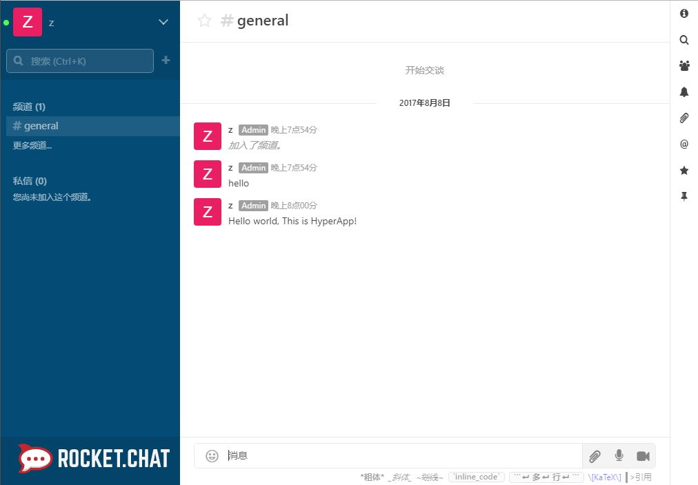

# Rocket Chat 教程

## 简介 

Rocket.Chat是使用Meteor框架做的开源消息应用。它支持视频会议、文件共享、语音等，使用Rocket.Chat可以完全控制交流通信。Rocket.Chat是特性最丰富的 Slack 开源替代品之一。它的主要功能：群组聊天，直接通信，私聊群，桌面通知，媒体嵌入，链接预览，文件上传，语音/视频 聊天，截图等等。下面记录了在HyperApp上安装配置Rocket.Chat的步骤。

## HyperApp 服务端配置

- 在安装`Rocket.Chat`前，需要先安装`MongoDB`,`Nginx Proxy`和`Nginx SSL Support`,它们三个的参数不需要变动。（如果之前已经安装了则可不用安装）

- 首先打开HyperApp在应用中找到Rocket.Chat,填写相关配置：

	* "Port" 留空即可
	* "Link Containers" 选择`MongoDB`

- 再展开"Show Nginx and SSL options"选项

	* "Custom Domain"填写你的域名
	* "Port"填写443
	* "HTTPS"推荐选择"Redirect http to https"

- 再来到"Nginx SSL Support"选项下

	* "Domain"填写你的域名
	* "Email"填写你的邮箱

全部填写好的示意图如下：


## 防火墙配置

- CentOS
```
firewall-cmd --add-port=80/tcp --permanent
firewall-cmd --add-port=443/tcp --permanent
firewall-cmd --reload
```
- Ubuntu
```
sudo ufw allow 80
sudo ufw allow 443
```

## 使用Rocket.Chat

打开浏览器，键入你的域名，回车即可看到Rocket.Chat的页面,注册好之后进如即可开始聊天。



大功告成！

