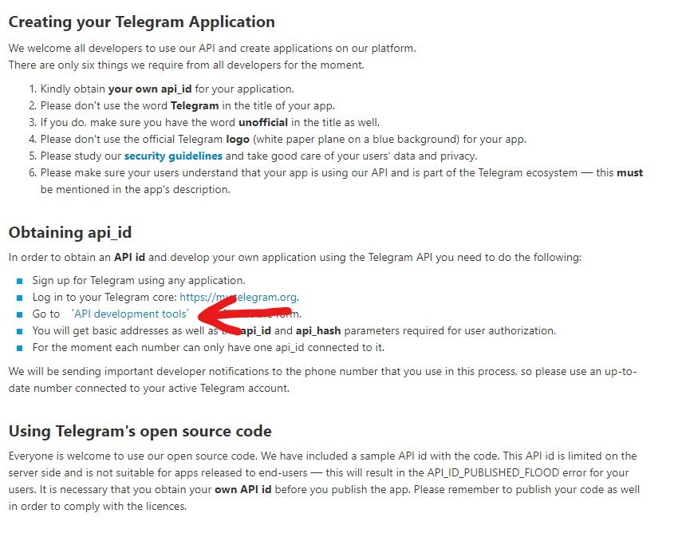
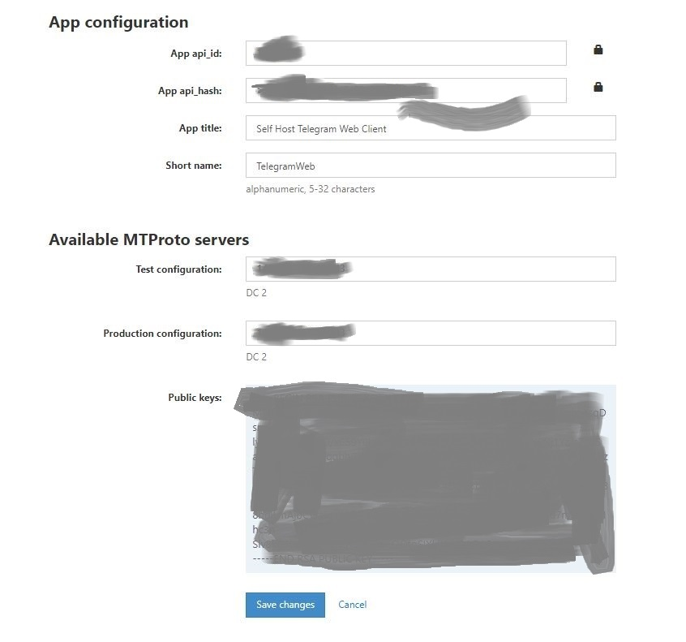

# 免爱国Telegram-Web部署教程

> 最近身边有些朋友看我玩Telmgran觉得很不错.也 想加入.但是苦于要爱国上网.那么今天给大家带来一篇搭建免爱国Telegram客户端教程

## 本文原文链接 https://vinga.ml/telegram 

## 准备

* 一个已经注册过Telegram的手机号
* 耐心.耐心.耐心

## 注册

1. **首先我们前往这个网站** [TelegramAppCreate](https://my.telegram.org/auth?to=apps)**来获取我们所需要的一些参数.**
   
2. **注意需要填写完整格式的手机号码例如`+861234567890`**
3. **验证码一般来说会发送到已登陆设备上面.但也有可能会发送短信验证码.注意查收.**
4. **通过之后来到这个界面 .这时候我们选择**`API Development Tool`
   
5. **再下一步会来到一个填写信息的界面.按照个人喜好来填写.我这里因为注册过一个了.当时没有截图就不提供图片了.**
6. **提交信息之后会到下一个界面.长这个样子.把App api_id以及App api_hash复制备用**
   

## 服务端配置

* **按照图中所提示的进行配置.**
* **请确认你已经按照默认配置正常安装并启动了Nginx Proxy以及Nginx SSL Support.**
* **确认你的域名已经解析正确.可以通过ping来验证`ping 你的域名`只要返回一个正确ip即为成功**
* **然后保存配置并且安装.**

## 大功告成

**现在去访问你的域名吧！**

## 写在最后

* 写了这么久.如果能有所收获那就是我最大的荣幸了:)
* 如果可以的话.可以关注一下 https://vinga.ml 这是我的私人博客地址:)
* 如有问题可发邮件至我邮箱fanalcest@gmail.com联系或telegram@fanvinga

