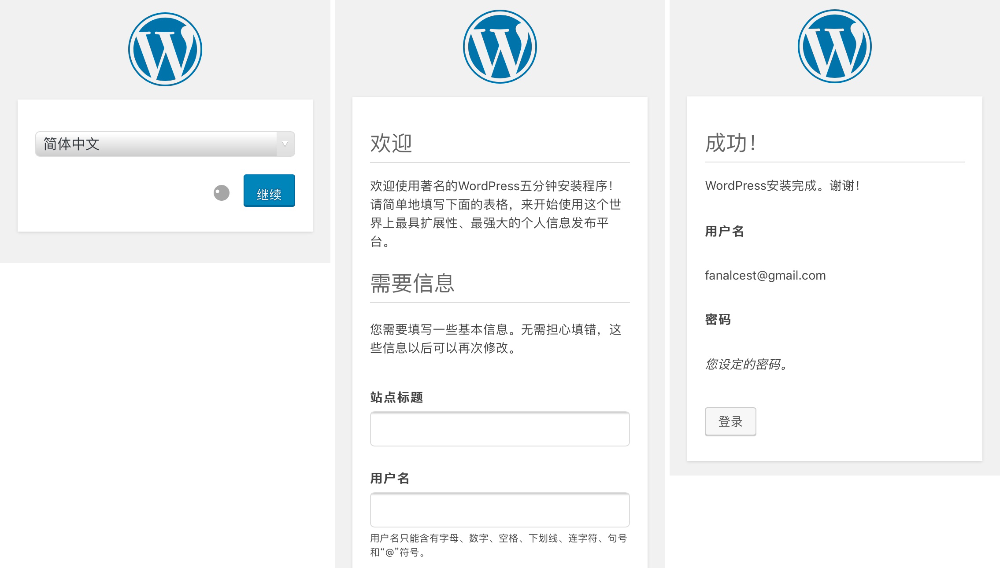
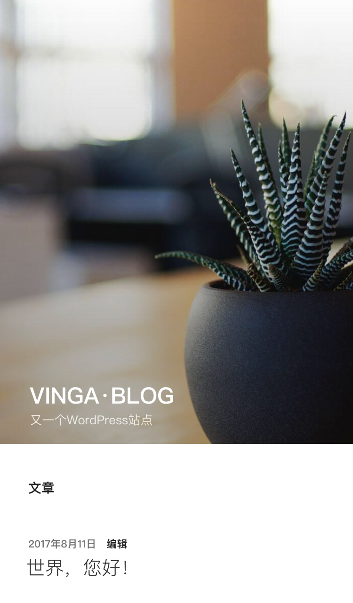

# WordPress搭建教程

> 之前写过一篇Hugo个人博客部署的教程.那是一个轻量化的选择.今天就给大家带来以丰富插件著称的WordPress的搭建教程

### 本文原文链接为 [wordpress](https://vinga.tech/wordpress)

## 准备工作

* **Hyperapp**
* **解析正确的域名（ping验证）**
* **耐心耐心耐心**

## 服务端部署

1. **wordpress的必选依赖为MySQL或MariaDB.可选依赖为Nginx Proxy以及Nginx SSL Support.如果不选用这两个.需要配置Port.然后通过`https://VPS的IP:端口`来访问.本教程默认已经正确安装并启动这两者.**
2. **按照下图对MariaDB以及WordPress进行部署.左一为MariaDB.左二三为WordPress.有中文提示的按提示修改.没有的保持一致.**
  
3. **部署完成之后选择保存配置并安装即可.注意.安装顺序为先部署MariaDB并安装启动之后再部署WordPress！**

## 登录域名进行WordPress后台配置

1. **首先会选择语言.划到底部选择简体中文即可**
2. **其次会对管理者以及网站信息进行设置.自己决定**
3. **设置完会返回成功.这时候登录即可**
4. **进去之后会提示要更新.按照提示确定更新.刷新一下回到主页就更新完了**
  

## 大功告成！

* 这里放一个美美哒的截图.~~Hugo大法好~~
  

