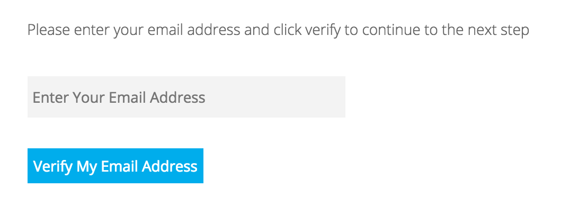

> 在今时今日.拥有一个自己的顶级域名已经成为了一种互联网的必需品(笑).言归正传.很多人觉得申请一个域名会是一件复杂而困难的事情.并且可能要花很多钱.那么今天为大家带来一篇免费的顶级域名的申请教程.

# 准备

* **一个可以正常接收邮件的邮箱**
* **一个可以访问的IP地址**

# 开始

**首先访问`www.freenom.com`.然后在屏幕中间输入框输入你想要的域名比如`fanvinga.ml`然后点击检查可用性**

## 

**然后选中自己喜欢的.点击现在获取.然后右上角购物车完成**

**来到下面这个界面.点击`Use DNS`.然后再点击`Use Freenom DNS Service`.HostName保持默认即可.看得懂的想改也没关系.IP Address填写你想解析的66.112.223.135.填写VPS的IP地址即可.记住别忘了选择12个月免费**

**下一步在这里填写你的邮箱.然后选择验证我的邮箱地址.然后从邮箱中打开发过来的链接即可进入下一步**

**在页面填上你的资料，最好使用美国的代理.然后找一个美国人信息生成器.按照相应信息填写即可.记得勾选我已阅读并同意条款和条件.当然填写自己的信息也没有问题.这里给出一个范例**

**接下来的步骤一路下一步.然后登陆的时候使用你的邮箱和刚刚的密码来登陆.稍等片刻即可解析完成.其他更多关于freenom的问题请进入hyperapp的Telegram交流群请教帅气的FanVinga:)**

**注:关于域名解析的有关知识.比如顶级域名.二级域名.A记录.CNAME等等请请教下面这位大神**

